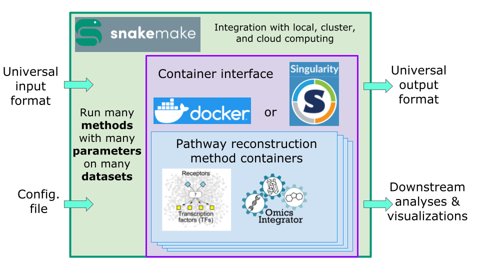

# Signaling Pathway Reconstruction Analysis Streamliner (SPRAS)
[](https://github.com/Reed-CompBio/spras/actions/workflows/test-spras.yml)

SPRAS is a work-in-progress dockerized library of pathway reconstruction enhancement tools.
The framework will contain different pathway reconstruction algorithms that connect genes and proteins of interest in the context of a general protein-protein interaction network, allowing users to run multiple algorithms on their inputs.
See the GLBIO 2021 [slides](https://doi.org/10.6084/m9.figshare.14551476) or [video](https://www.youtube.com/watch?v=nU8EARwMqdM&list=PLmX8XnLr6zeHlqhhxDy4fA5o65Q6m76KX&index=19) for more information.
To read more about the specific pathway reconstruction algorithms that may be supported in the future, refer to [our list of algorithms](doc/) within the `doc/` directory.

This repository is very much a work in progress and is not yet stable enough for real data analysis.
The latest features can be found on various development branches.
The instructions below support running SPRAS with a fixed configuration on example data to demonstrate its functionality.
Open a [GitHub issue](https://github.com/Reed-CompBio/spras/issues) or contact [Anthony Gitter](https://www.biostat.wisc.edu/~gitter/) or [Anna Ritz](https://www.reed.edu/biology/ritz/) to provide feedback on this early version of SPRAS.

SPRAS is inspired by tools for single-cell transcriptomics such as [BEELINE](https://github.com/Murali-group/Beeline) and [dynverse](https://github.com/dynverse) that provide a unified interface to many related algorithms.

  
SPRAS overview showing [PathLinker](https://github.com/Murali-group/PathLinker) and [Omics Integrator](https://github.com/fraenkel-lab/OmicsIntegrator) as representative pathway reconstruction algorithms.

## Installing and running SPRAS
SPRAS requires
- Files in this repository
- Python
- The Python packages listed in [`environment.yml`](environment.yml)
- Docker

First, download or clone this repository so that you have the Snakefile, example config file, and example data.

The easiest way to install Python and the required packages is with [Anaconda](https://www.anaconda.com/download/).
The Carpentries [Anaconda installation instructions](https://carpentries.github.io/workshop-template/#python) provide guides and videos on how to install Anaconda for your operating system.
After installing Anaconda, you can run the following commands from the root directory of the `spras` repository
```
conda env create -f environment.yml
conda activate spras
```
to create a conda environment with the required packages and activate that environment.
If you have a different version of Python already, you can install the specified versions of the required packages in your preferred manner instead of using Anaconda.

SPRAS can also be installed with Python's package manager `pip` by running `python -m pip install .` from the repo's root directory. This makes SPRAS more portable by allowing you to run
snakemake anywhere the Snakefile, data, and configuration file can be accessed. However, use caution when pip installing directly to your computer without using some form of virtual
environment as this can alter your system's underlying python modules, which could lead to unexpected behavior.

For developers, SPRAS can be installed via `pip` with the `-e` flag, as in `python -m pip install -e .`. This points Python back to the SPRAS repo so that any changes made to the source
code are reflected in the installed module.

You also need to install [Docker](https://docs.docker.com/get-docker/).
After installing Docker, start Docker before running SPRAS.

Once you have activated the conda environment and started Docker, you can run SPRAS with the example Snakemake workflow.
From the root directory of the `spras` repository, run the command
```
snakemake --cores 1 --configfile config/config.yaml
```
This will run the SPRAS workflow with the example config file (`config/config.yaml`) and input files.
Output files will be written to the `output` directory.

You do not need to manually download Docker images from DockerHub before running SPRAS.
The workflow will automatically download any missing images as long as Docker is running.

## Components
**Configuration file**: Specifies which pathway reconstruction algorithms to run, which hyperparameter combinations to use, and which datasets to run them on.

**Snakemake file**: Defines a workflow to run all pathway reconstruction algorithms on all datasets with all specified hyperparameters.

**Dockerized pathway reconstruction algorithms**: Pathway reconstruction algorithms are run via Docker images using the docker-py Python package.
[PathLinker](https://github.com/Murali-group/PathLinker), [Omics Integrator](https://github.com/fraenkel-lab/OmicsIntegrator), [Omics Integrator 2](https://github.com/fraenkel-lab/OmicsIntegrator2), and [Maximum Edge Orientation](https://github.com/agitter/meo/) are the first supported algorithms.
The files to create these Docker images are in the `docker-wrappers` subdirectory along with links to algorithms' original repositories.
The Docker images are available on [DockerHub](https://hub.docker.com/orgs/reedcompbio).

**Python wrapper for calling algorithms**: Wrapper functions provide an interface between the common file formats for input and output data and the algorithm-specific file formats and reconstruction commands.
These wrappers are in the `spras/` subdirectory.

**Test code**: Tests for the Docker wrappers and SPRAS code.
The tests require the conda environment in `environment.yml` and Docker.
Run the tests with `pytest -s`.

## Singularity
Some computing environments are unable to run Docker and prefer Singularity as the container runtime.
SPRAS has limited experimental support for Singularity instead of Docker, and only for some pathway reconstruction algorithms.
SPRAS uses the spython package to interface with Singularity, which only supports Linux.

## Attribution
SPRAS builds on public datasets and algorithms.
If you use SPRAS in a research project, please cite the original datasets and algorithms in addition to SPRAS.

Part of `ml.py` is taken from the [scikit-learn example code](https://scikit-learn.org/stable/auto_examples/cluster/plot_agglomerative_dendrogram.html).
The original third-party code is available under the BSD 3-Clause License, Copyright © 2007 - 2023, scikit-learn developers.
