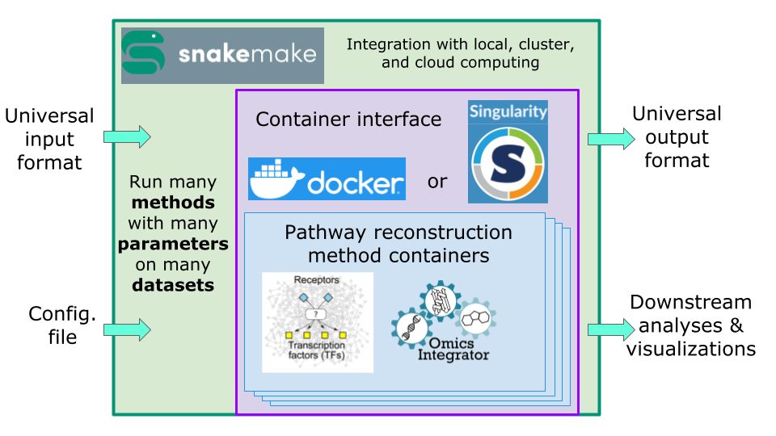

# Signaling Pathway Reconstruction Analysis Streamliner (SPRAS)
[](https://github.com/Reed-CompBio/spras/actions/workflows/test-spras.yml)
[](https://spras.readthedocs.io)


## Overview

SPRAS is a work-in-progress dockerized library of pathway reconstruction enhancement tools.
The framework will contain different pathway reconstruction algorithms that connect genes and proteins of interest in the context of a general protein-protein interaction network, allowing users to run multiple algorithms on their inputs.
See the GLBIO 2021 [slides](https://doi.org/10.6084/m9.figshare.14551476) or [video](https://www.youtube.com/watch?v=nU8EARwMqdM&list=PLmX8XnLr6zeHlqhhxDy4fA5o65Q6m76KX&index=19) for more information.
To read more about the specific pathway reconstruction algorithms that may be supported in the future, refer to [our list of algorithms](https://spras.readthedocs.io/en/latest/prms/prms.html).

This repository is very much a work in progress and is not yet stable enough for real data analysis.
The latest features can be found on various development branches.
The instructions below support running SPRAS with a fixed configuration on example data to demonstrate its functionality.
Open a [GitHub issue](https://github.com/Reed-CompBio/spras/issues) or contact [Anthony Gitter](https://gitterlab.org/) or [Anna Ritz](https://www.reed.edu/biology/ritz/) to provide feedback on this early version of SPRAS.

SPRAS is inspired by tools for single-cell transcriptomics such as [BEELINE](https://github.com/Murali-group/Beeline) and [dynverse](https://github.com/dynverse) that provide a unified interface to many related algorithms.


SPRAS overview showing [PathLinker](https://github.com/Murali-group/PathLinker) and [Omics Integrator](https://github.com/fraenkel-lab/OmicsIntegrator) as representative pathway reconstruction algorithms.

## Hardware Requirements

We recommend running with at least 4 cores and 16 GBs of RAM.

## Operating systems

SPRAS runs on Linux, macOS, and Windows.

Our continuous integration runs on GitHub Actions using Ubuntu 24.04.5, macOS 26.6.2, Windows 10.0.26100.

## Installing SPRAS and setting up software dependencies

The setup should take around 10 minutes.

SPRAS requires
- Files in this repository
- Python
- The Python packages listed in [`environment.yml`](environment.yml)
- Docker

First, download or clone this repository so that you have the Snakefile, example config file, and example data.

The easiest way to install Python and the required packages is with [Anaconda](https://www.anaconda.com/download/).
The Carpentries [Anaconda installation instructions](https://carpentries.github.io/workshop-template/#python) provide guides and videos on how to install Anaconda for your operating system.
After installing Anaconda, you can run the following commands from the root directory of the `spras` repository
```
conda env create -f environment.yml
conda activate spras
```
to create a conda environment with the required packages and activate that environment.
If you have a different version of Python already, you can install the specified versions of the required packages in your preferred manner instead of using Anaconda.

While the `spras` conda environment comes bundled with all of Python dependencies needed for `spras` to run, it does not yet have a working installation of `spras` itself.
To install `spras` in the environment, finish by running the following from the root directory of the repository:
```bash
python -m pip install .
```
Use caution when pip installing directly to your computer without using some form of virtual/conda environment as this can alter your system's underlying Python modules, which could lead to unexpected behavior.
In most cases, you should only `pip install` spras if you're already working in the `spras` conda environment!

For developers, SPRAS can be installed via `pip` with the `-e` flag, as in `python -m pip install -e .`. This points Python back to the SPRAS repo so that any changes made to the source
code are reflected in the installed module.

You also need to install [Docker](https://docs.docker.com/get-docker/).
After installing Docker, start Docker before running SPRAS.

## Running SPRAS with a test dataset

Running SPRAS locally on the test dataset takes around 10 minutes.

Once you have activated the conda environment and started Docker, you can run SPRAS on an example data.
From the root directory of the `spras` repository, run the command
```
snakemake --cores 1 --configfile config/config.yaml
```

This will run the SPRAS workflow with the example config file (`config/config.yaml`) and input files.
The run covers 12 algorithms on two toy datasets, across parameter
combination listed in the config, followed by the post-processing analyses that
the config enables. Output files are written to the `output` directory.

You do not need to manually download Docker images from DockerHub before running SPRAS.
The workflow will automatically download any missing images as long as Docker is running.

#### The toy dataset

The example config defines two small datasets built from the files in `input/`:

- `data0`: `network.txt` as the interactome, with `node-prizes.txt`,
  `sources.txt`, and `targets.txt` as node inputs
- `data1`: `alternative-network.txt`, with `node-prizes.txt`, `sources.txt`, and
  `alternative-targets.txt`

Four gold standard sets are declared (`gs_nodes0.txt`, `gs_nodes1.txt`,
`gs_edges0.txt`, `gs_edges1.txt`) and mapped to the two datasets.

#### Expected output

Output is written to the `output` directory. For each dataset, expect:

- **19 pathway directories**, one per algorithm-parameter combination, named
  `{dataset}-{algorithm}-params-{hash}`. Across both datasets that is 38
  reconstructions.
- `{dataset}-pathway-summary.txt`, node and edge counts and topological
  statistics for every output pathway for that dataset.
- `{dataset}-ml/`, the machine learning comparison of those output pathways.
- `{dataset}-cytoscape.cys`, a Cytoscape session holding every pathway graph for
  that dataset.
- `{dataset}-{gold_standard}-eval/`, one directory per dataset-gold standard pair
  declared in `gold_standards`, holding the corresponding evaluations.
- `dataset-{dataset}-merged.pickle`, the merged input data, plus
  `gs-{gold_standard}-merged.pickle` for each gold standard.
- `logs/` and `prepared/`, holding the parameter-hash mappings and the
  algorithm-specific input files generated before each run.

### Running SPRAS with HTCondor
Large SPRAS workflows may benefit from execution with HTCondor, a scheduler/manager for distributed high-throughput computing workflows that allows many Snakemake steps to be run in parallel. For instructions on running SPRAS in this setting, see `docker-wrappers/SPRAS/README.md`.

### Running on your own data

1. Format your interactome and node files per [our input format docs](https://spras.readthedocs.io/en/latest/output.html).
2. Place them under `input/`, or another directory and add the path to `data_dir`, which is
   read relative to the spras directory.
3. Write a configuration file following the format of `config/config.yaml`:
   - Add a `datasets` entry with a label and your `node_files` and `edge_files`.
     Labels may contain only letters, numbers, and underscores.
   - Set `include: true` for each algorithm you want and list its parameter
     values. List-valued parameters expand combinatorially, so a few extra values
     multiply the number of runs quickly.
   - To score against a gold standard, add a `gold_standards` entry listing
     either `node_files` or `edge_files` (not both) and the `dataset_labels` it
     applies to. Then set `analysis.ml.include` and `analysis.evaluation.include`
     to `true`; evaluation does not run unless ML is also enabled.
4. Run `snakemake --cores <N> --configfile <config-file>`.

More instructions provided in our [documentation](https://spras.readthedocs.io).


## Components
**Configuration file**: Specifies which pathway reconstruction algorithms to run, which hyperparameter combinations to use, and which datasets to run them on.

**Snakemake file**: Defines a workflow to run all pathway reconstruction algorithms on all datasets with all specified hyperparameters.

**Dockerized pathway reconstruction algorithms**: Pathway reconstruction algorithms are run via Docker images using the docker-py Python package.
[PathLinker](https://github.com/Murali-group/PathLinker), [Omics Integrator](https://github.com/fraenkel-lab/OmicsIntegrator), [Omics Integrator 2](https://github.com/fraenkel-lab/OmicsIntegrator2), and [Maximum Edge Orientation](https://github.com/agitter/meo/) are the first supported algorithms.
The files to create these Docker images are in the `docker-wrappers` subdirectory along with links to algorithms' original repositories.
The Docker images are available on [DockerHub](https://hub.docker.com/orgs/reedcompbio).

**Python wrapper for calling algorithms**: Wrapper functions provide an interface between the common file formats for input and output data and the algorithm-specific file formats and reconstruction commands.
These wrappers are in the `spras/` subdirectory.

**Test code**: Tests for the Docker wrappers and SPRAS code.
The tests require the conda environment in `environment.yml` and Docker.
Run the tests with `pytest -s`.

## Singularity
Some computing environments are unable to run Docker and prefer Singularity as the container runtime.
SPRAS has limited experimental support for Singularity instead of Docker, and only for some pathway reconstruction algorithms.
SPRAS uses the spython package to interface with Singularity, which only supports Linux.

## Attribution
SPRAS builds on public datasets and algorithms.
If you use SPRAS in a research project, please cite the original datasets and algorithms in addition to SPRAS.

Part of `ml.py` is taken from the [scikit-learn example code](https://scikit-learn.org/stable/auto_examples/cluster/plot_agglomerative_dendrogram.html).
The original third-party code is available under the BSD 3-Clause License, Copyright © 2007 - 2023, scikit-learn developers.
