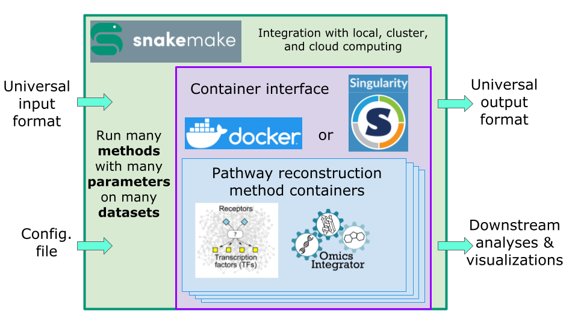

.. SPRAS documentation master file, created by
   sphinx-quickstart on Wed Jan 29 20:10:33 2025.
   You can adapt this file completely to your liking, but it should at least
   contain the root `toctree` directive.

.. raw:: html

   

       <strong>🚧 Under Construction 🚧</strong>
       
This documentation is currently under construction. Some sections may be incomplete or subject to change.

   

Welcome to SPRAS's documentation!
=================================

SPRAS is a Python package that builds on `Snakemake <https://snakemake.readthedocs.io>`_ and
`Docker <https://en.wikipedia.org/wiki/Docker_(software)>`_ to provide a standardized,
reproducible, and scalable framework for applying pathway reconstruction
methods (PRMs) to omics data.

.. toctree::
   :maxdepth: 1
   :caption: Getting Started

   about
   install
   usage

.. toctree::
   :maxdepth: 1
   :caption: Manual

   output

.. toctree::
   :maxdepth: 1
   :caption: Supported Algorithms

   prms/prms

.. toctree::
   :maxdepth: 1
   :caption: SPRAS API Docs For Developers

   fordevs/modules

.. toctree::
   :maxdepth: 1
   :caption: Contributing

   contributing

Indices and tables
==================

* :ref:`genindex`
* :ref:`modindex`
* :ref:`search`
