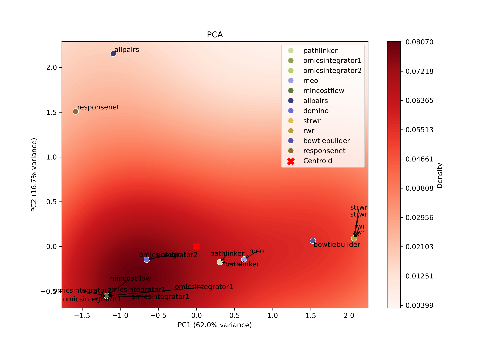
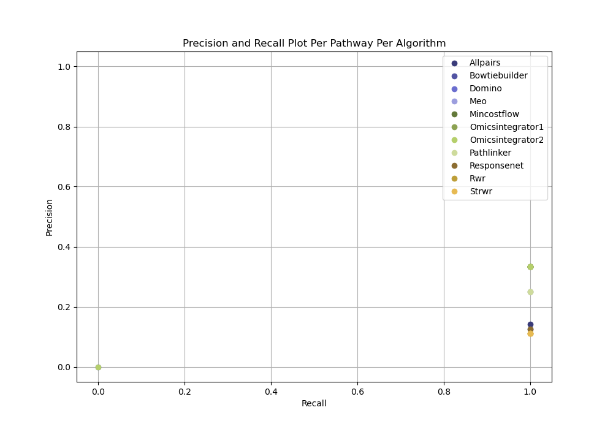
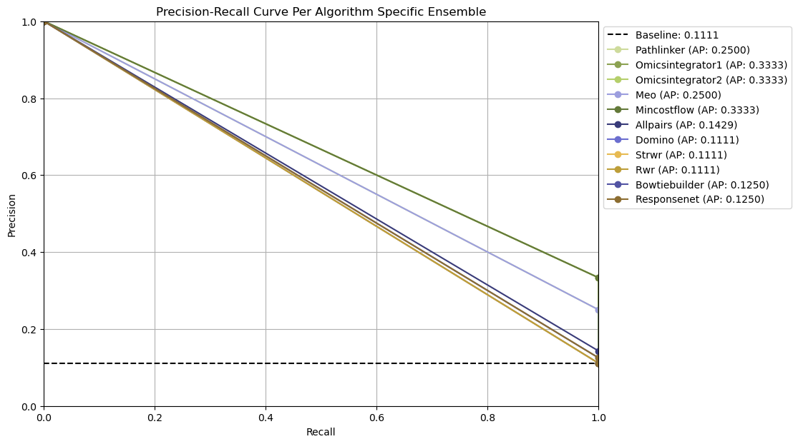
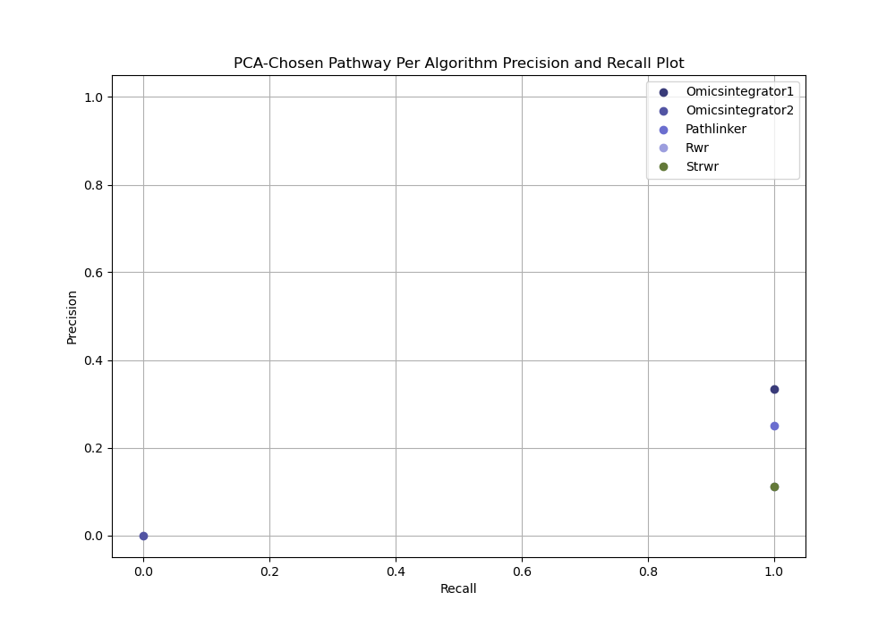

###################################
Advanced Capabilities and Features
###################################

Parameter tuning
================
Parameter tuning is the process of determining which parameter combinations should be explored for each algorithm for a given dataset.
Parameter tuning focuses on defining and refining the parameter search space.

Each dataset has unique characteristics so there are no preset parameters combinations to use and instead must be tuned individually for an algorithm.
SPRAS provides a flexible framework for getting parameter grids for any algorithms for a given dataset.

Grid Search
------------

A grid search systematically tests different combinations of parameter values to see how each affects network reconstruction results.

In SPRAS, users can define parameter grids for each algorithm directly in the configuration file.
When executed, SPRAS automatically runs each algorithm across all parameter combinations and collects the resulting subnetworks.

SPRAS will also supports parameter refinement using graph topological heuristics.
These topological metrics help identify parameter regions that produce stable or biologically plausible outputs networks.
Based on these heuristics, SPRAS will generate new configuration files with refined parameter grids for each algorithm per dataset.

Users can then further narrow these grids around promising regions to fine-tune the outputs an algorithm produces.

Parameter selection
-------------------

Parameter selection refers to the process of determining which parameter combinations should be used for evalaution and how to identify the “best” set of parameters per algorithm for a given dataset.

Parameter selection is handled in the evaluation code, which supports multiple parameter selection strategies.

Once the grid space search is complete for each dataset, the user can enable evaluation (by setting evaluation include to true) and it will run all of the parameter selection code.

PCA-based parameter selection
^^^^^^^^^^^^^^^^^^^^^^^^^^^^^^

The PCA-based approach identifies a representative parameter setting for each pathway reconstruction algorithm on a given dataset.
It selects the single parameter combination that best captures the central trend of an algorithm's reconstruction behavior.

.. raw:: html

   

For each algorithm, all reconstructed subnetworks are projected into an algorithm-specific PCA space.
This projection summarizes how the algorithm's outputs vary across different parameter combinations, allowing patterns in the outputs to be visualized in a lower-dimensional space.

Within each PCA space, a kernel density estimate (KDE) is computed over the projected points to identify regions of high density.
The output closest to the highest KDE peak is selected as the most representative parameter setting, as it corresponds to the region where the algorithm most consistently produces similar subnetworks.

Ensemble network-based parameter selection
^^^^^^^^^^^^^^^^^^^^^^^^^^^^^^^^^^^^^^^^^^^
The ensemble-based approach combines results from all parameter settings for each pathway reconstruction algorithm on a given dataset.
Instead of focusing on a single "best" parameter combination, it summarizes the algorithm's overall reconstruction behavior across parameters.

All reconstructed subnetworks are merged into algorithm-specific ensemble networks, where each edge weight reflects how frequently that interaction appears across the outputs.
Edges that occur more often are assigned higher weights, highlighting interactions that are most consistently recovered by the algorithm.

These consensus networks help identify the core patterns of an algorithm's output's without needing to choose a single parameter setting.

.. This approach is useful when users want to understand the overall stability of an algorithm's reconstructions or when no clear optimal parameter combination exists.

Ground truth-based evaluation without parameter selection
^^^^^^^^^^^^^^^^^^^^^^^^^^^^^^^^^^^^^^^^^^^^^^^^^^^^^^^^^^

The no parameter selection approach chooses all parameter combinations for each pathway reconstruction algorithm on a given dataset.
This approach can be useful for idenitifying patterns in algorithm performance without favoring any specific parameter setting.

Evaluation
============

In some cases, users may have a gold standard file that allows them to evaluate the quality of the reconstructed subnetworks generated by pathway reconstruction algorithms.

However, gold standards may not exist for certain types of experimental data where validated ground truth interactions or molecules are unavailable or incomplete. 
For example, in emerging research areas or poorly characterized biological systems, interactions may not yet be experimentally verified or fully known, making it difficult to define a reliable reference network for evaluation.

Adding gold standard datasets and evaluation post analysis a configuration
--------------------------------------------------------------------------

In the configuration file, users can specify one or more gold standard datasets to evaluate the subnetworks reconstructed from each dataset.
When gold standards are provided and evaluation is enabled (include: true), SPRAS will automatically compare the reconstructed subnetworks for a specific dataset against the corresponding gold standards.

.. code-block:: yaml

    gold_standards:
        - 
        label: gs1
        node_files: ["gs_nodes0.txt", "gs_nodes1.txt"]
        data_dir: "input"
        dataset_labels: ["data0"]
        - 
        label: gs2
        edge_files: ["gs_edges0.txt"]
        data_dir: "input"
        dataset_labels: ["data0", "data1"]

    analysis:
        evaluation:
        include: true

A gold standard dataset must include the following types of keys and files:

- label: a name that uniquely identifies a gold standard dataset throughout the SPRAS workflow and outputs.
- node_file or edge_file: A list of node or edge files. Only one of these can be defined per gold standard dataset.
- data_dir: The file path of the directory where the input gold standard dataset files are located.
- dataset_labels: a list of dataset labels indicating which datasets this gold standard dataset should be evaluated against.

When evaluation is enabled, SPRAS will automatically run its built-in evaluation analysis on each defined dataset-gold standard pair.
This evaluation computes metrics such as precision, recall, and precision-recall curves, depending on the parameter selection method used.

For each pathway, evaluation can be run independently of any parameter selection method (the ground truth-based evaluation without parameter selection idea) to directly inspect precision and recall for each reconstructed network from a given dataset.

.. raw:: html

   

Ensemble-based parameter selection generates precision-recall curves by thresholding on the frequency of edges across an ensemble of reconstructed networks for an algorithm for given dataset.

.. raw:: html

   

PCA-based parameter selection computes a precision and recall for a single reconstructed network selected using PCA from all reconstructed networks for an algorithm for given dataset.

.. raw:: html

   

.. note:: 
    Evaluation will only execute if ml include is also set to true, since the parameter selection step depends on the PCA ML analysis.

.. note:: 
    To see evaluation in action, run SPRAS using the config.yaml or egfr.yaml configuration files.

CHTC integration
=================

Running locally hard and slow when too many algo parameter datasets 
Need way to run long term
SPRAS runs jobs; CHTC can run these jobs in parallel when available

Ability to run with different container frameworks
---------------------------------------------------

CHTC requires apptainer/singularity
- SPRAS allows a user to change the type of images to use 

1. Global Workflow Control

Sets options that apply to the entire workflow.

- Examples: the container framework (docker, singularity, dsub) and where to pull container images from

