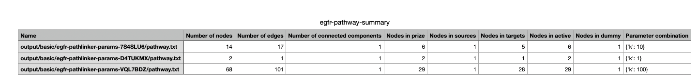
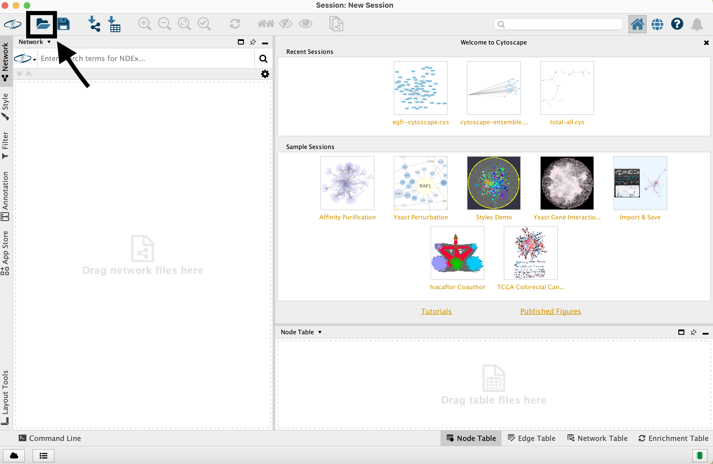
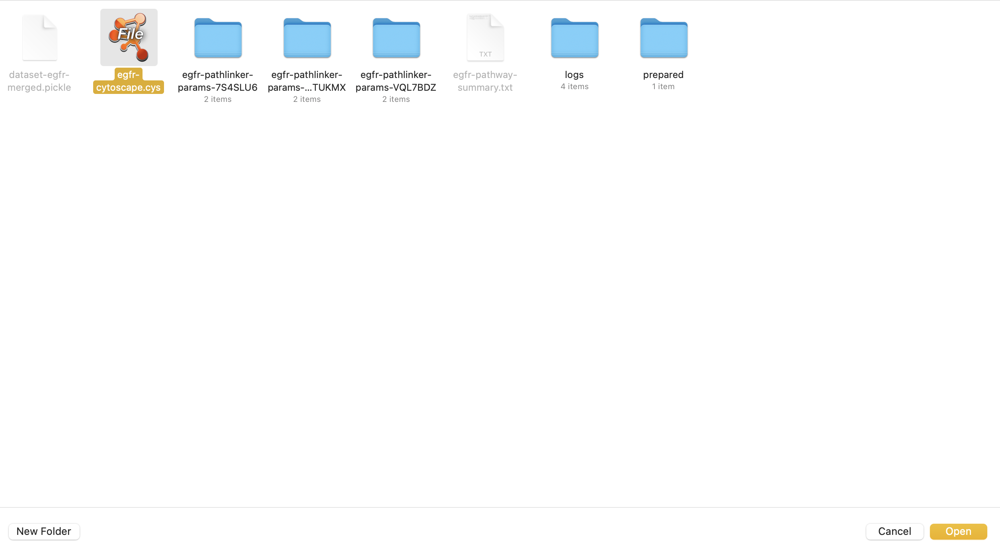
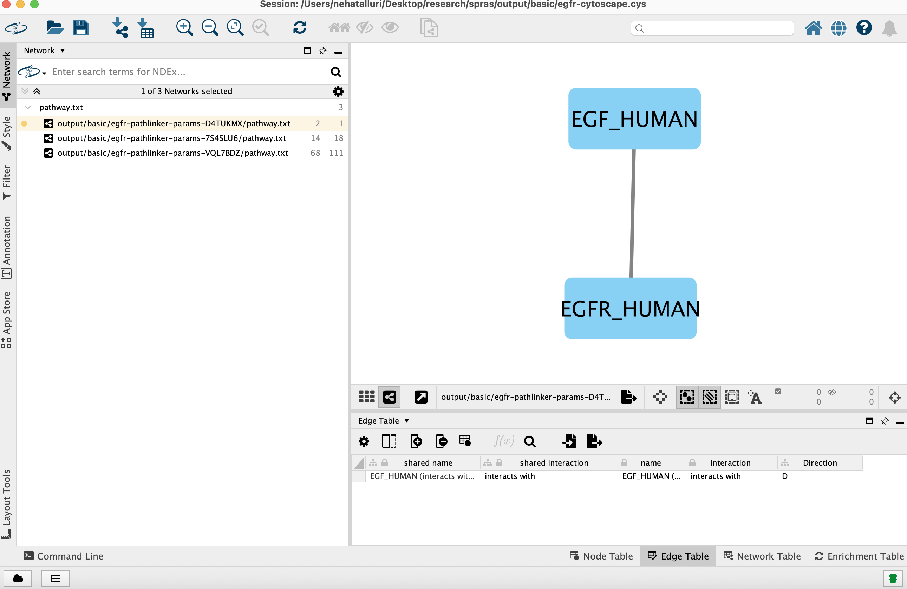
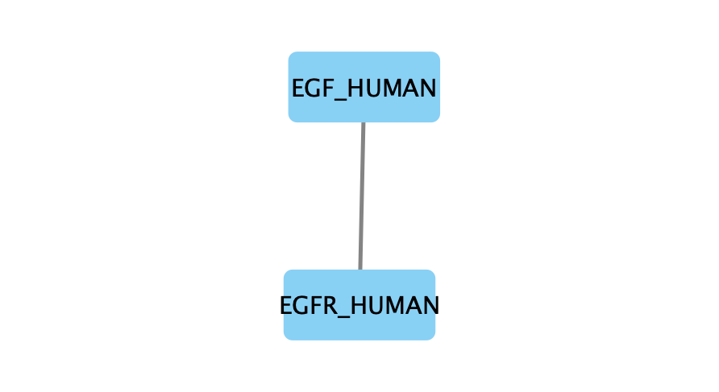
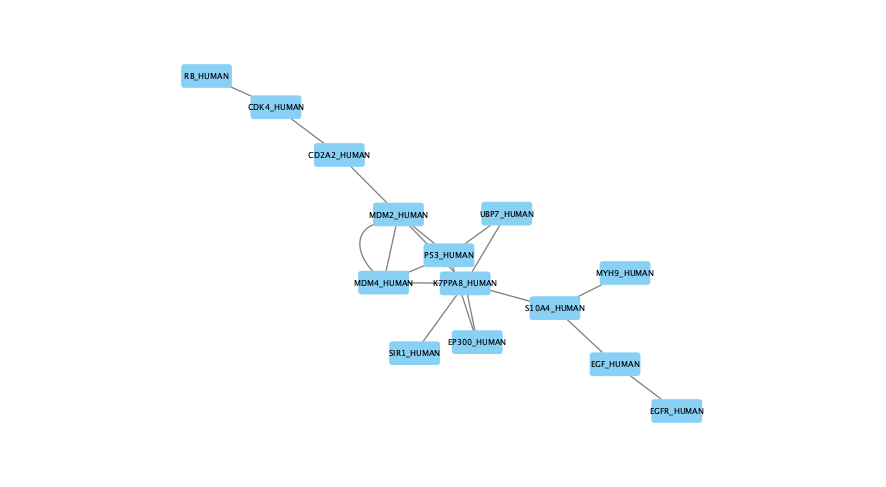
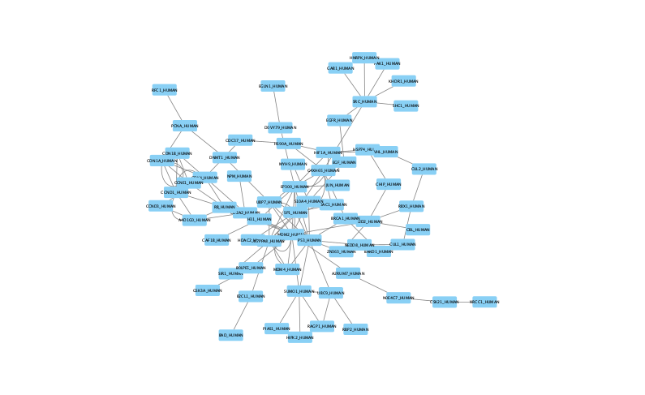

##################################################
Beginner Tutorial - Set up & Running One Algorithm
##################################################

This tutorial provides a hands-on introduction to SPRAS. It is designed to show participants how to install the software, run example workflows, and use tools to interpret the results.

You will learn how to:

- Set up the SPRAS software environment
- Explore the folder structure and understand how inputs, configurations, and outputs are organized
- Configure and run a pathway reconstruction algorithm on a provided dataset
- Enable post-analysis steps to generate post analysis information

Step 0: Clone the SPRAS repository, set up the environment, and run Docker
==========================================================================

0.1 Clone the SPRAS repository
-------------------------------

Visit the `SPRAS GitHub repository <https://github.com/Reed-CompBio/spras>`__ and clone it locally

0.2 Set up the SPRAS environment
-------------------------------------

From the root directory of the SPRAS repository, create and activate the Conda environment and install the SPRAS python package:

.. code:: bash

    conda env create -f environment.yml
    conda activate spras
    python -m pip install .

.. note::
   The first command performs a one-time installation of the SPRAS dependencies by creating a Conda environment (an isolated space that keeps all required packages and versions separate from your system).

   The second command activates the newly created environment so you can use these dependencies when running SPRAS; this step must be done each time you open a new terminal session.

   The last command is a one-time installation of the SPRAS package into the environment.

0.3 Test the installation
-------------------------

Run the following command to confirm that SPRAS has been set up successfully from the command line:

.. code:: bash

   python -c "import spras; print('SPRAS import successful')"

0.4 Start Docker
----------------

Before running SPRAS, make sure Docker Desktop is running.

Launch Docker Desktop and wait until it says "Docker is running".
   
.. note::
   SPRAS itself does not run inside a Docker container.
   However, Docker is required because SPRAS uses it to execute individual pathway reconstruction algorithms and certain post-analysis steps within isolated containers.
   These containers include all the necessary dependencies to run each algorithm or post analysis.

Step 1: Configuration files
============================

A configuration file specifies how a SPRAS workflow should run; think of it as the control center for the workflow.

It defines which algorithms to run, the parameters to use, the datasets and gold standards to include, the analyses to perform after reconstruction, and the container settings for execution. 

The configuration files used are written in YAML, a human-readable format that uses simple indentation and key-value pairs for data seralizaiton.

SPRAS uses Snakemake to read the YAML configuration file and execute a SPRAS workflow accordingly.

.. Snakemake considers a task from the configuration file complete once the expected output files are present in the output directory. 
.. As a result, rerunning the same configuration file may do nothing if those files already exist. 
.. To continue or rerun SPRAS with the same configuration file, delete the output directory (or its contents) or modify the configuration file so Snakemake regenerates new results.

1.1 Save config for this tutorial
----------------------------------

For this part of the tutorial, we'll use a pre-defined configuration file. 
Download it here: :download:`Beginner Config File <../_static/config/beginner.yaml>`

Save the file into the ``config/`` folder of your SPRAS installation.
After adding this file, your directory structure will look like this (ignoring the rest of the folders):

.. code-block:: text

   spras/
   ├── config/
   │   ├── beginner.yaml
   │   └── ... other configs ...
   ├── inputs/
   │   ├── phosphosite-irefindex13.0-uniprot.txt # pre-defined in SPRAS already, used by the beginner.yaml file
   │   ├── tps-egfr-prizes.txt # pre-defined in SPRAS already, used by the beginner.yaml file
   │   └── ... other input data ...

config/
^^^^^^^^^

The ``config/`` folder stores configuration files for SPRAS.

.. note::
   You can store configuration files anywhere, as long as you provide the correct path when running SPRAS (explained later in this tutorial).

inputs/
^^^^^^^^

The ``inputs/`` folder contains input data files.
You can use the provided example datasets or add your own for custom experiments to this folder.

.. note::
   Input files can be stored anywhere as long as their paths are correctly referenced in the configuration file (explained later in this tutorial).

1.2 Overview of the major sections of a configuration file:
------------------------------------------------------------

Algorithms
^^^^^^^^^^^

.. code-block:: yaml
    
    algorithms:
    - name: omicsintegrator1
      params:
         include: true
         run1:
            b: 0.1
            d: 10
            g: 1e-3
         run2:
            b: [0.55, 2, 10]
            d: [10, 20]
            g: 1e-3
   

When defining an algorithm in the configuration file, its name must match one of the supported SPRAS algorithms.
Each algorithm includes an include flag, which you set to true to have Snakemake run it, or false to disable it. 

Algorithm parameters can be organized into one or more run blocks (e.g., run1, run2, …), with each block containing key-value pairs.
When defining a parameter, it can be passed as a single value or passed by listing parameters within a list.
If multiple parameters are defined as lists within a run block, SPRAS generates all possible combinations (Cartesian product) of those list values together with any fixed single-value parameters in the same run block. 
Each unique combination runs once per algorithm.

Each algorithm exposes its own set of parameters that control its optimization strategy.
Some algorithms have no adjustable parameters, while others include multiple tunable settings that influence how subnetworks are created.
These parameters vary widely between algorithms and reflect the unique optimization techniques each method employs under the hood.

(See :doc:`Pathway Reconstruction Methods <../prms/prms>` for information about algorithms and their parameters).

Datasets
^^^^^^^^^^^

.. code-block:: yaml

    datasets:
    - 
        label: egfr
        node_files: ["prizes.txt", "sources-targets.txt"]
        edge_files: ["interactome.txt"]
        other_files: []
        data_dir: "input"
    
In the configuration file, datasets are defined under the datasets section. 
Each dataset you define will be run against all of the algorithms enabled in the configuration file.

A dataset must include the following types of keys and files:

- label: a name that uniquely identifies a dataset throughout the SPRAS workflow and outputs
- node_files: Input files listing nodes of interest
- edge_files: Input interactome file that defines the relationships between nodes
- other_files: This placefolder is not used
- data_dir: The file path of the directory where the input dataset files are located

.. note::
   A node represents a molecule, and an edge represents an interaction connecting two molecules.
   An interactome is a large network of possible interactions that defines many edges connecting molecules.

Reconstruction settings
^^^^^^^^^^^^^^^^^^^^^^^^^

.. code-block:: yaml

    reconstruction_settings:
    locations:
        reconstruction_dir: "output"

The reconstruction_settings section controls where outputs are stored.
Set reconstruction_dir to the directory path where you want results saved. SPRAS will automatically create this folder if it doesn't exist.

Analysis
^^^^^^^^^

.. code-block:: yaml

    analysis:
    summary:
        include: true
    cytoscape:
        include: true
    ml:
        include: true
   

SPRAS includes multiple downstream analyses that can be toggled on or off directly in the configuration file. 
When enabled, these analyses are performed per dataset and produce summaries or visualizations of the results from all enabled algorithms for that dataset.

.. note::
   The configuration file and sections shown here do not represent the full set of options available in SPRAS.
   
   The SPRAS documentation is still under construction, and the examples provided (like ``beginner.yaml``) only show the basic configuration needed for this tutorial.
   
   To see a more complete set of configurable options and parameters, refer to the full examples in ``config/config.yaml`` and ``config/egfr.yaml`` within the SPRAS repository.

Step 2: Running SPRAS on a provided example dataset 
====================================================

2.1 Running SPRAS with the beginner configuration
-------------------------------------------------
In the ``beginner.yaml`` configuration file, it is set up have SPRAS run a single algorithm with one parameter setting on one dataset.

From the root directory, run the command below from the command line:

.. code:: bash

    snakemake --cores 1 --configfile config/beginner.yaml

This command starts the workflow manager that automates all steps defined by SPRAS.
It tells Snakemake to use one CPU core and to load settings from the  ``config/beginner.yaml`` file.

What happens when you run this command
^^^^^^^^^^^^^^^^^^^^^^^^^^^^^^^^^^^^^^^

SPRAS will execute quickly from your perspective; however, several automated steps (handled by Snakemake and Docker) occur behind the scenes.

.. note::
   On Apple computers (M1/M2/M3 chips), the first run may take slightly longer because the SPRAS Docker images are built for AMD architectures, not ARM, so Docker must perform additional image translation before execution.

1. Snakemake starts the workflow

Snakemake reads the options set in the ``beginner.yaml`` configuration file and determines which datasets, algorithms, and parameter combinations need to run and if any post-analysis steps were requested.

2. Creating algorithm-specific inputs

For each algorithm marked as include: true in the configuration, SPRAS generates input files tailored to those algorithms using the dataset specified in the config file. 

In this case, only PathLinker is enabled. 
SPRAS creates the files required by PathLinker and places them in the ``prepared/egfr-pathlinker-inputs/``.

4. Organizing results with parameter hashes

Each new <dataset>-<algorithm>-params-<hash> combination gets its own folder created in ``output/basic/``.

For this configuration file only ``egfr-pathlinker-params-D4TUKMX/`` in ``output/basic`` is created.
D4TUKMX is a hash that uniquely identifies a specific parameter combination (k = 10). 

A matching log file is placed in ``logs/parameters-pathlinker-params-D4TUKMX.yaml`` which records the exact parameter value used.

5. Running the algorithm

SPRAS downloads the PathLinker Docker image from `DockerHub <https://hub.docker.com/u/reedcompbio>`__ and launches it in a container, sending the prepared input files and specific parameter settings needed for execution.

PathLinker runs and generates an output file named ``raw-pathway.txt``, which contains the reconstructed subnetwork in PathLinker's algorithm-specific format.

SPRAS then saves this file in its corresponding folder.

6. Standardizing the results

SPRAS parses the raw PathLinker output into a standardized SPRAS format (``pathway.txt``) and SPRAS saves this file in its corresponding folder.

7. Logging the Snakemake run 

Snakemake creates a dated log in ``.snakemake/log/``. This log shows what jobs ran and any errors that occurred during the SPRAS run.

What your directory structure should like after this run:
^^^^^^^^^^^^^^^^^^^^^^^^^^^^^^^^^^^^^^^^^^^^^^^^^^^^^^^^^
.. code-block:: text

   spras/
   ├── .snakemake/
   │   └── log/
   │       └── ... snakemake log files ...
   ├── config/
   │   └── beginner.yaml
   ├── inputs/
   │   ├── phosphosite-irefindex13.0-uniprot.txt
   │   └── tps-egfr-prizes.txt
   ├── outputs/
   │   └── beginner/
   │       └── egfr-pathlinker-params-D4TUKMX/
   │            └── pathway.txt
   │            └── raw-pathway.txt
   │       └── logs/
   │                └── dataset-egfr.yaml
   │                └── parameters-pathlinker-params-D4TUKMX.yaml
   │       └── prepared/
   │            └── egfr-pathlinker-inputs
   │                └── network.txt
   │                └── nodetypes.txt
   │       └── dataset-egfr-merged.pickle

After running the SPRAS command two more folders are added to SPRAS

.snakemake/log/
^^^^^^^^^^^^^^^

The ``.snakemake/log/`` folder contains records of all Snakemake jobs that were executed for the SPRAS run.

output/
-------

The ``ouput/`` folder stores the results generated during a SPRAS workflow.

.. note:: 
   Output folders and files can be stored anywhere, as long as the reconstruction_dir parameter in the configuration file is set to the directory path where you want the results to be saved.

.. note::
   SPRAS has additional files and directories to use during runs. However, for most users, and for the purposes of this tutorial, it isn't necessary to fully understand them.

2.4 Running SPRAS with more parameter combinations
---------------------------------------------------

In the ``beginner.yaml`` configuration file, uncomment the run2 section under pathlinker so it looks like:

.. code-block:: yaml
    
    run2:   
        k: [10, 100] 

With this update, the ``beginner.yaml`` configuration file is set up have SPRAS run a single algorithm with multiple parameter settings on one dataset.

After saving the changes, rerun with:

.. code:: bash

    snakemake --cores 1 --configfile config/beginner.yaml

What happens when you run this command
^^^^^^^^^^^^^^^^^^^^^^^^^^^^^^^^^^^^^^^

1.	Snakemake loads the configuration file

Snakemake again reads ``beginner.yaml`` to determine which datasets, algorithms, parameters, and post-analyses to run. 

It reuses cached results to skip completed steps, rerunning only those that are new or outdated. 
Here, the Pathlinker prepared inputs are reused.

2. Organizing outputs per parameter combination

Each new <dataset>-<algorithm>-params-<hash> combination gets its own folder created in ``output/basic/``.

A matching log file is placed in ``logs/parameters-<dataset>-params-<hash>.yaml`` which records the exact parameter value used.

3. Reusing prepared inputs with additional parameter combinations

For each new parameter combination and its corresponding cached prepared inputs, SPRAS executes PathLinker by launching multiple Docker contatiners (once for each parameter configuration). 

PathLinker then runs and produces a ``raw-pathway.txt`` file specific to each parameter and places it in it's corresponding folder.

4. Parsing into standardized results

SPRAS parses each new ``raw-pathway.txt`` file into a standardized SPRAS format (``pathway.txt``) and places it in it's corresponding folder.

5. Logging the Snakemake run 

Snakemake creates a dated log in ``.snakemake/log/``.

What your directory structure should like after this run:
^^^^^^^^^^^^^^^^^^^^^^^^^^^^^^^^^^^^^^^^^^^^^^^^^^^^^^^^^
.. code-block:: text

   spras/
   ├── .snakemake/
   │   └── log/
   │       └── ... snakemake log files ...
   ├── config/
   │   └── beginner.yaml
   ├── inputs/
   │   ├── phosphosite-irefindex13.0-uniprot.txt
   │   └── tps-egfr-prizes.txt
   ├── outputs/
   │   └── beginner/
   │       └── egfr-pathlinker-params-7S4SLU6/
   │            └── pathway.txt
   │            └── raw-pathway.txt
   │       └── egfr-pathlinker-params-D4TUKMX/
   │            └── pathway.txt
   │            └── raw-pathway.txt
   │       └── egfr-pathlinker-params-VQL7BDZ/
   │            └── pathway.txt
   │            └── raw-pathway.txt
   │       └── logs/
   │                └── dataset-egfr.yaml
   │                └── parameters-pathlinker-params-7S4SLU6.yaml
   │                └── parameters-pathlinker-params-D4TUKMX.yaml
   │                └── parameters-pathlinker-params-VQL7BDZ.yaml
   │       └── prepared/
   │            └── egfr-pathlinker-inputs
   │                └── network.txt
   │                └── nodetypes.txt
   │       └── dataset-egfr-merged.pickle

2.5 Reviewing the pathway.txt Files 
------------------------------------

Each ``pathway.txt`` file contains the standardized reconstructed subnetworks and can be used at face value, or for further post analysis.

1.	Locate the files

Navigate to the output ``directory spras/output/beginner/``. Inside, you will find subfolders corresponding to each <dataset>-<algorithm>-params-<hash> combination.

2. Open a ``pathway.txt`` file

Each file lists the network edges that were reconstructed for that specific run. The format includes columns for the two interacting nodes, the rank, and the edge direction

For example, the file ``egfr-pathlinker-params-7S4SLU6/pathway.txt`` contains the following reconstructed subnetwork:

.. code-block:: text
        
    Node1	Node2	Rank	Direction
    EGF_HUMAN	EGFR_HUMAN	1	D
    EGF_HUMAN	S10A4_HUMAN	2	D
    S10A4_HUMAN	MYH9_HUMAN	2	D
    K7PPA8_HUMAN	MDM2_HUMAN	3	D
    MDM2_HUMAN	P53_HUMAN	3	D
    S10A4_HUMAN	K7PPA8_HUMAN	3	D
    K7PPA8_HUMAN	SIR1_HUMAN	4	D
    MDM2_HUMAN	MDM4_HUMAN	5	D
    MDM4_HUMAN	P53_HUMAN	5	D
    CD2A2_HUMAN	CDK4_HUMAN	6	D
    CDK4_HUMAN	RB_HUMAN	6	D
    MDM2_HUMAN	CD2A2_HUMAN	6	D
    EP300_HUMAN	P53_HUMAN	7	D
    K7PPA8_HUMAN	EP300_HUMAN	7	D
    K7PPA8_HUMAN	UBP7_HUMAN	8	D
    UBP7_HUMAN	P53_HUMAN	8	D
    K7PPA8_HUMAN	MDM4_HUMAN	9	D
    MDM4_HUMAN	MDM2_HUMAN	9	D

Step 3: Running Post-Analyses 
==============================

3.1 Adding post-analyses to the beginner configuration
------------------------------------------------------

To enable downstream analyses, update the analysis section in your configuration file by setting both summary and cytoscape to true. 

Your analysis section in the configuration file should look like this:

.. code-block:: yaml

    analysis:
        summary:
            include: true 
        cytoscape:
            include: true 

``summary`` generates graph topological summary statistics for each algorithm's parameter combination output, generating a summary file for all reconstructed subnetworks for a given dataset.

This will report these statistics for each pathway:

- Number of nodes
- Number of edges
- Number of connected components
- Network density
- Maximum degree
- Median degree
- Maximum diameter
- Average path length

``cytoscape`` creates a Cytoscape session file (.cys) that includes all reconstructed subnetworks for a given dataset, eliminating the need to manually create an individual visualization per output.
This makes it easy to upload and visualize all the results directly within Cytoscape.

With this update, the ``beginner.yaml`` configuration file is set up for SPRAS to run two post-analyses on the outputs generated by a single algorithm that was executed with multiple parameter settings on one dataset.

After saving the changes, rerun with:

.. code:: bash

    snakemake --cores 1 --configfile config/beginner.yaml

What happens when you run this command
^^^^^^^^^^^^^^^^^^^^^^^^^^^^^^^^^^^^^^^
1. Reusing cached results

Snakemake reads the options set in  ``beginner.yaml`` and checks for any requested post-analysis steps. 

It reuses cached results; here the ``pathway.txt`` files generated from the previously executed PathLinker algorithm on the egfr dataset are reused.

2.	Running the summary analysis

SPRAS aggregates the ``pathway.txt`` files from all selected parameter combinations into a single summary table. 

The results are saved in ``egfr-pathway-summary.txt``.

3.	Running the Cytoscape analysis

All ``pathway.txt`` files from the chosen parameter combinations are collected and passed into the Cytoscape Docker image. 

A Cytoscape session file is then generated, containing visualizations for each pathway and saved as ``egfr-cytoscape.cys``.

What your directory structure should like after this run:
^^^^^^^^^^^^^^^^^^^^^^^^^^^^^^^^^^^^^^^^^^^^^^^^^^^^^^^^^^^
.. code-block:: text

   spras/
   ├── .snakemake/
   │   └── log/
   │       └── ... snakemake log files ...
   ├── config/
   │   └── beginner.yaml
   ├── inputs/
   │   ├── phosphosite-irefindex13.0-uniprot.txt
   │   └── tps-egfr-prizes.txt
   ├── outputs/
   │   └── beginner/
   │       └── egfr-pathlinker-params-7S4SLU6/
   │            └── pathway.txt
   │            └── raw-pathway.txt
   │       └── egfr-pathlinker-params-D4TUKMX/
   │            └── pathway.txt
   │            └── raw-pathway.txt
   │       └── egfr-pathlinker-params-VQL7BDZ/
   │            └── pathway.txt
   │            └── raw-pathway.txt
   │       └── logs/
   │                └── dataset-egfr.yaml
   │                └── parameters-pathlinker-params-7S4SLU6.yaml
   │                └── parameters-pathlinker-params-D4TUKMX.yaml
   │                └── parameters-pathlinker-params-VQL7BDZ.yaml
   │       └── prepared/
   │            └── egfr-pathlinker-inputs
   │                └── network.txt
   │                └── nodetypes.txt
   │       └── dataset-egfr-merged.pickle
   │       └── egfr-cytoscape.cys
   │       └── egfr-pathway-summary.txt

3.1 Reviewing the outputs
--------------------------

Reviewing the summary file
^^^^^^^^^^^^^^^^^^^^^^^^^^^
1. Open the summary statistics file

In your file explorer, go to ``output/beginner/egfr-pathway-summary.txt`` and open it locally.

.. raw:: html

   

This file summarizes the graph topological statistics for each output ``pathway.txt`` file for a given dataset, 
along with the parameter combinations that produced them, allowing you to interpret and compare algorithm outputs side by side in a compact format.

Reviewing outputs in Cytoscape
^^^^^^^^^^^^^^^^^^^^^^^^^^^^^^^

.. note::
   Cytoscape is an open-source software platform for visualizing networks.
   It allows you to explore networks interactively, apply layouts and styles, and integrate additional data for deeper analysis.

1.	Open Cytoscape

Launch the Cytoscape application on your computer.

2.	Load the Cytoscape session file

Navigate to  ``output/beginner/egfr-cytoscape.cys`` and open it in Cytoscape.

.. raw:: html

   

   

.. raw:: html

   

Once loaded, the session will display all reconstructed subnetworks for a given dataset, organized by algorithm and parameter combination.

You can view and interact with each reconstructed subnetwork. Compare how the different parameter settings influence the pathways generated.

The small parameter value (k=1) produced a compact subnetwork:

.. raw:: html

   

The moderate parameter value (k=10) expanded the subnetwork, introducing additional nodes and edges that may uncover new connections:

.. raw:: html

   

The large parameter value (k=100) generates a much denser subnetwork, capturing a broader range of edges but also could introduce connections that may be less  meaningful:

.. raw:: html

   

