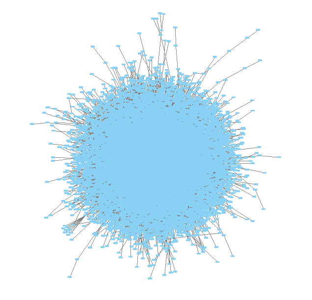
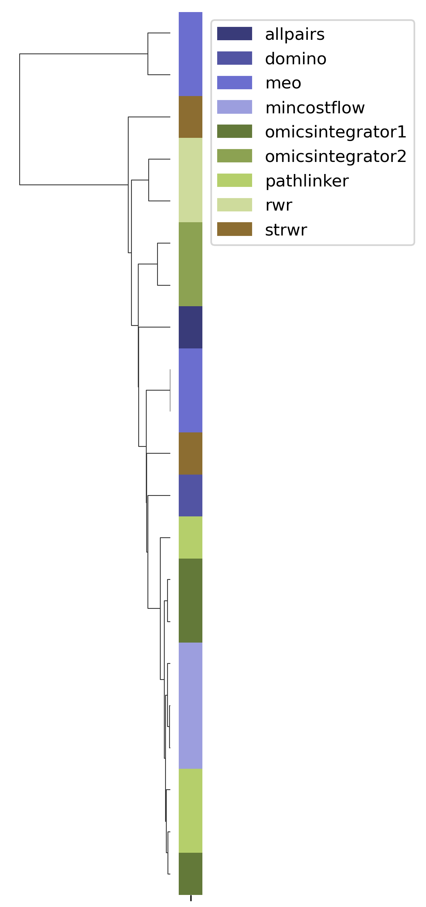
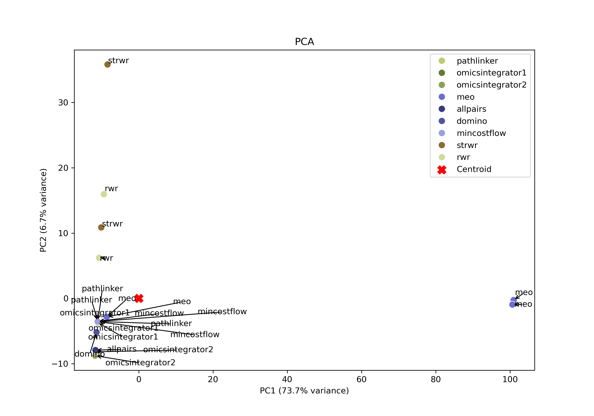
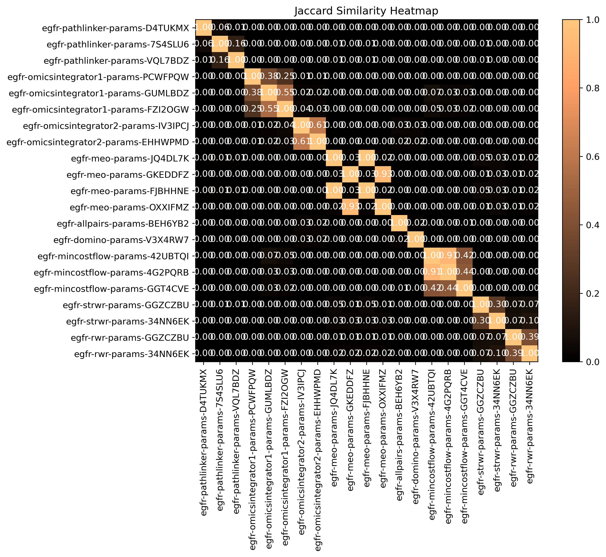

###########################################################
Intermediate Tutorial - Prepare Data & Multi-Algorithm Runs
###########################################################

This tutorial builds on the introduction to SPRAS from the previous tutorial. 

It guides participants through how to convert data into a format usable by pathway reconstruction algorithms, run multiple algorithms within a single workflow, and apply new tools to interpret and compare the resulting pathways.

You will learn how to:

- Prepare and format data for use with SPRAS
- Configure and run additional pathway reconstruction algorithms on a dataset
- Enable post-analysis steps to generate post analysis information

Step 1: Transforming high throughput experimental data into SPRAS compatible input data
========================================================================================

1.1 What is the SPRAS-standardized input data?
-----------------------------------------------

A pathway reconstruction algorithm requires a set of input nodes and an interactome; however, each algorithm expects its inputs to follow a unique format.

To simplify this process, SPRAS requires all input data in a dataset to be formatted once into a standardized SPRAS format.
SPRAS then automatically generates algorithm-specific input files when an algorithm is enabled in the configuration file.

.. note::
    Each algorithm uses the input nodes to guide or constrain the optimization process used to construct reconstruct subnetworks.

    An algorithm maps these input nodes onto the interactome and uses the network to identify connecting paths between the input nodes to form subnetworks.

Pathway reconstruction algorithms differ in the inputs nodes they require and how they interpret those nodes to identify subnetworks.

- Some use source and target nodes to defined start and end points. 
- Some use prizes, which assign numerical scores assigned to nodes of interest.
- Some rely on active nodes, representing nodes that are significantly “on” under specific conditions.

An example of a node file required by SPRAS follows a tab-separated format:

.. code-block:: text

    NODEID  prize sources targets active
    A       1.0     True            True
    B       3.3             True    True
    C       2.5     True            True
    D       1.9             True    True

.. note::
    If a user provides only one type of input node but wants to run algorithms that require a different type, SPRAS can automatically convert the inputs into the compatible format:

    - Source-target nodes can be used with all algorithms by making a prize column set to 1 and an active column set to True
    - Prize data can be adapted for active based algorithms by automatically making an active column set to True
    - Active data can be adapted for prize based algorithms by making a prize column set to 1

Along with differences in their inputs nodes, pathway reconstruction algorithms also interpret the input interactome differently.

- Some can handle directed interactomes, others work only with undirected interactomes, and a few support mixed directionaltiy interactomes.

SPRAS automatically converts the user-provided edge file into the format expected by each algorithm, ensuring that the directionality of the interactome matches the algorithm's requirements.

An example of an edge file required by SPRAS follows a tab-separated format:

.. code-block:: text

    A	B   0.98   U
    B	C   0.77   D

.. note::  
    SPRAS supports multiple standardized input formats.
    More information about input data formats can be found in the ``inputs/README.md`` file within the SPRAS repository.

1.2 Example high throughput data
---------------------------------

An example dataset is the EGF response mass spectrometry data, which includes three biological replicates, each with two technical replicates (IMAC and IP).
For each biological replicate, the technical replicates are combined to produce a single dataset of peptide abundances measured over time (0-124 minutes).

.. note::
    Mass spectrometry is a technique used to measure and identify proteins in a sample.
    It works by breaking proteins into smaller pieces called peptides and measuring their mass using their mass-to-charge ratio.
    The data show how much of each peptide is present which can show protein levels change under different conditions.

    Since proteins interact with each other in biological pathways, changes in their levels can reveal which parts of a pathway are active or affected.
    By mapping these changing proteins onto known interaction networks, pathway reconstruction algorithms can identify which signaling pathways are likely involved in the biological response to a specific condition.

Example of one of the biological replicate A with one peptide:

.. list-table::
   :header-rows: 1
   :widths: 20 15 10 10 10 10 10 10 10 10 10 10 

   * - peptide
     - protein
     - gene.name
     - modified.sites
     - 0 min
     - 2 min
     - 4 min
     - 8 min
     - 16 min
     - 32 min
     - 64 min
     - 128 mn
   * - K.n[305.21]AFWMAIGGDRDEIEGLS[167.00]S[167.00]DEEH.-
     - Q6PD74,B4DG44,Q5JPJ4,Q6AWA0
     - AAGAB
     - S310,S311
     - 14.97
     - 14.81
     - 13.99
     - 13.98
     - 12.87
     - 13.88
     - 13.91
     - 15.60
    

The goal is to turn this experimental data into the format that SPRAS expects.

1.3 Filtering and normalizing the replicates
----------------------------------------------

Before analysis, we filter out peptides not present in all three replicates to ensure consistency.
Then, we normalize each replicate so intensity values are comparable and not biased by replicate-specific effects.

.. list-table::
   :header-rows: 1
   :widths: 20 15 10 10 10 10 10 10 10 10 10 10 10

   * - peptide
     - protein
     - gene.name
     - modified.sites
     - 0 min
     - 2 min
     - 4 min
     - 8 min
     - 16 min
     - 32 min
     - 64 min
     - 128 mn
     - replicate
   * - K.n[305.21]AFWMAIGGDRDEIEGLS[167.00]S[167.00]DEEH.-
     - Q6PD74,B4DG44,Q5JPJ4,Q6AWA0
     - AAGAB
     - S310,S311
     - 2.17
     - 2.09
     - 1.98
     - 1.78
     - 1.99
     - 2.12
     - 2.25
     - 1.46
     - C
   * - K.n[305.21]AFWMAIGGDRDEIEGLS[167.00]S[167.00]DEEH.-
     - Q6PD74,B4DG44,Q5JPJ4,Q6AWA0
     - AAGAB
     - S310,S311
     - 4.03
     - 3.73
     - 3.32
     - 3.36
     - 3.35
     - 3.37
     - 3.35
     - 3.86
     - B
   * - K.n[305.21]AFWMAIGGDRDEIEGLS[167.00]S[167.00]DEEH.-
     - Q6PD74,B4DG44,Q5JPJ4,Q6AWA0
     - AAGAB
     - S310,S311
     - 5.60
     - 4.75
     - 4.69
     - 4.59
     - 4.32
     - 4.90
     - 4.90
     - 5.48
     - A
     
1.4 Computing p-values using Tukey's HSD Test
-----------------------------------------------

We want to calculate the p-values per peptide.
This tells us how likely changes in abundance happen by chance.

We use Tukey's Honest Significant Difference (HSD) test to compare all time points and correct for multiple testing to get a p-value for every pair of time points.

.. list-table::
   :header-rows: 1
   :widths: 25 20 7 7 7 7 7 7 7 7 7 7 7 7 7 7 7 7 7 7 7 7 7 7 7 7 7 7 7 7

   * - peptide
     - protein
     - 2min vs 0min
     - 4min vs 0min
     - 8min vs 0min
     - 16min vs 0min
     - 32min.vs.0min
     - 64min.vs.0min
     - 128min.vs.0min
     - 4min.vs.2min
     - 8min.vs.2min
     - 16min.vs.2min
     - 32min.vs.2min
     - 64min.vs.2min
     - 128min.vs.2min
     - 8min.vs.4min
     - 16min.vs.4min
     - 32min.vs.4min
     - 64min.vs.4min
     - 128min.vs.4min
     - 16min.vs.8min
     - 32min.vs.8min
     - 64min.vs.8min
     - 128min.vs.8min
     - 32min.vs.16min
     - 64min.vs.16min
     - 128min.vs.16min
     - 64min.vs.32min
     - 128min.vs.32min
     - 128min.vs.64min
   * - K.n[305.21]ADVLEAHEAEAEEPEAGK[432.30]S[167.00]EAEDDEDEVDDLPSSR.R
     - QQ6PD74,B4DG44,Q5JPJ4,Q6AWA0
     - 0.67
     - 0.25
     - 0.14
     - 0.12	
     - 0.52
     - 0.76
     - 0.84
     - 0.99
     - 0.93	
     - 0.90	
     - 1.00	
     - 1.00
     - 1.00
     - 1.00
     - 1.00
     - 1.00
     - 0.97
     - 0.94
     - 1.00
     - 0.98
     - 0.87
     - 0.80
     - 0.96
     - 0.83
     - 0.75
     - 1.00
     - 1.00
     - 1.00

Lower p-values indicate stronger evidence that a peptide's abundance significantly changes between those time points.

1.5 From p-values to prizes 
----------------------------

P-values are transformed using ``-log10(p-value)`` so smaller p-values give larger prize scores.

For each peptide, the smallest p-value is selected (representing the most significant change) between each time point to the baseline (0 min) and between consecutive time points.

For each protein mapped to multiple peptides, the maximum prize value across all its peptides is assigned.

Finally, all protein identifiers (using the first one listed for each protein) are converted to UniProt Entry Names to match the identifiers that will be used in the interactome. 

.. note::
    All node identifiers should use the same namespace across every part of the data in a dataset.

.. list-table::
   :header-rows: 1
   :widths: 25 20 7 7 7

   * - peptide
     - protein
     - uniprot entry name
     - min p-value
     - -log10(min p-value)
   * - K.n[305.21]AFWMAIGGDRDEIEGLS[167.00]S[167.00]DEEH.-
     - Q6PD74,B4DG44,Q5JPJ4,Q6AWA0
     - AAGAB_HUMAN 
     - 0.12392034609392
     - 0.906857382317364

Input node data put into a SPRAS-standardized format:

.. code-block:: text

    NODE_ID     prize
    AAGAB_HUMAN	0.906857382

1.6 From Prizes to Source and Targets / Actives 
-----------------------------------------------

.. image:: ../_static/images/egf-pathway.png
   :alt: description of the image
   :width: 400
   :align: center

.. raw:: html

   

Using known pathway knowledge [1]_ [2]_ [3]_:

- EGF serves as a source for the pathway
- EGF is known to initiate signaling, so it can be assigned a high score (greater than all other nodes) to emphasize its importance and guide algorithms to start reconstruction from this point.
- EGFR acts as a target in the pathway
- All other downstream proteins detected in the data can also treated as targets
- All proteins in the data can be considered active since they correspond to proteins that are active under the given biological condition

Input node data put into a SPRAS-standardized format:

.. code-block:: text

    NODE_ID     prize       source  target  active
    AAGAB_HUMAN	0.906857382         True   True
    ... more nodes
    EGF_HUMAN	10	        True	True	True
    EGFR_HUMAN	6.787874699		    True	True
    ... more nodes

1.8 Finding an Interactome to use
----------------------------------

To connect our proteins, we use a background protein-protein interaction (PPI) network (the interactome).
For this dataset, two interactomes are merged (directed edges prioritized when available):

- iRefIndex v13 (159,095 undirected interactions)
- PhosphoSitePlus (4,080 directed kinase-substrate interactions)

.. raw:: html

   

The final network has 15,677 proteins and 157,984 edges (~4k of them are directed), and covers 653 of our 702 prize proteins.
The proteins identifiers in the interactome are converted to use UniProt Entry Names.

Interactome data put into a SPRAS-standardized format:

.. code-block:: text

    TACC1_HUMAN	RUXG_HUMAN	0.736771	U
    TACC1_HUMAN	KAT2A_HUMAN	0.292198	U
    TACC1_HUMAN	CKAP5_HUMAN	0.724783	U
    TACC1_HUMAN	YETS4_HUMAN	0.542597	U
    TACC1_HUMAN	LSM7_HUMAN	0.714823	U
    AURKC_HUMAN	TACC1_HUMAN	0.553333	D
    TACC1_HUMAN	AURKA_HUMAN	0.401165	U
    TACC1_HUMAN	KDM1A_HUMAN	0.367850	U
    TACC1_HUMAN	MEMO1_HUMAN	0.367850	U
    TACC1_HUMAN	HD_HUMAN	0.367850	U
    ... more edges

.. note::
    Many databases exist that provide interactomes. One being `STRING <https://string-db.org/>`__, which contains known protein-protein interactions across different species.

1.9 This SPRAS-standardized data is already saved into SPRAS
------------------------------------------------------------

.. code-block:: text

   spras/
   ├── .snakemake/
   │   └── log/
   │       └── ... snakemake log files ...
   ├── config/
   │   └── ...
   ├── inputs/
   │   ├── phosphosite-irefindex13.0-uniprot.txt # pre-defined in SPRAS already, used by the intermediate.yaml file
   │   └── tps-egfr-prizes.txt # pre-defined in SPRAS already, used by the intermediate.yaml file
   ├── outputs/
   │   └── basic/
   │       └── ... output files ...

The data used in this part of the tutorial can be found in the `supplementary materials <https://pmc.ncbi.nlm.nih.gov/articles/PMC6295338/>`_ under data supplement 2 and supplement 3 [4]_.

Step 2: Running multiple algorithms 
====================================

We can begin running multiple pathway reconstruction algorithms.

For this part of the tutorial, we'll use a pre-defined configuration file that includes additional algorithms and post-analysis steps available in SPRAS.
Download it here: :download:`Intermediate Config File <../_static/config/intermediate.yaml>`

Save the file into the config/ folder of your SPRAS installation.

After adding this file, your directory structure will look like this (ignoring the rest of the folders):

.. code-block:: text

   spras/
   ├── .snakemake/
   │   └── log/
   │       └── ... snakemake log files ...
   ├── config/
   │   ├── basic.yaml
   │   ├── intermediate.yaml
   │   └── ... other configs ...
   ├── inputs/
   │   ├── phosphosite-irefindex13.0-uniprot.txt # pre-defined in SPRAS already, used by the intermediate.yaml file
   │   ├── tps-egfr-prizes.txt # pre-defined in SPRAS already, used by the intermediate.yaml file
   │   └── ... other input data ...
   ├── outputs/
   │   └── basic/
   │       └── ... output files ...

2.1 Algorithms in SPRAS
---------------------------------

SPRAS supports a wide range of algorithms, each designed around different biological assumptions and optimization strategies 
(See :doc:`Pathway Reconstruction Methods <../prms/prms>` for SPRAS's list of integrated algorithms.)

Wrapped algorithms
^^^^^^^^^^^^^^^^^^^
Each pathway reconstruction algorithm within SPRAS has actually been wrapped by SPRAS.

For an algorithm-specific wrapper, the wrapper includes a module that will create and format the input files required by the algorithm using the SPRAS-standardized input data.

Each algorithm has an associated Docker image located on `DockerHub <https://hub.docker.com/u/reedcompbio>`__ that contains all necessary software dependencies needed to run it.
For an algorithm-specific wrapper, it contains a module that will call each image to launch a container for a specified parameter combination, set of prepared algorithm-specific inputs and an output filename (``raw-pathway.txt``).

With each of the ``raw-pathway.txt`` files, an algorithm-specific wrapper includes a module that will convert the algorithm-specific format into a standardized SPRAS format.

2.3 Running SPRAS with multiple algorithms
------------------------------------------
In the ``intermediate.yaml`` configuration file, it is set up to have SPRAS run multiple algorithms with multiple parameter settings on a single dataset.

From the root directory, run the command below from the command line:

.. code:: bash

    snakemake --cores 4 --configfile config/intermediate.yaml

What happens when you run this command
^^^^^^^^^^^^^^^^^^^^^^^^^^^^^^^^^^^^^^^

SPRAS will run "slower" when using the ``intermediate.yaml`` configuration. 

Similar automated steps from the previous tutorial runs behind the scenes for ``intermediate.yaml``. 
However, this configuration now runs multiple algorithms with different parameter combinations, which takes longer to complete.
By increasing the number of cores to 4, it allows Snakemake to parallelize the work locally, speeding up execution when possible.
(See :doc:`Using SPRAS <../usage>` for more information on SPRAS's parallelization.)

1. Snakemake starts the workflow

Snakemake reads the options set in the ``intermediate.yaml`` configuration file and determines which datasets, algorithms, and parameter combinations need to run. 
It also checks if any post-analysis steps were requested.

2. Creating algorithm-specific inputs

For each algorithm marked as include: true in the configuration, SPRAS generates input files tailored to that algorithm. 

In this case, every algorithm is enabled, so SPRAS formats the input files required for each algorithm.

3. Organizing results with parameter hashes

Each <dataset>-<algorithm>-params-<hash> combination gets its own folder created in ``output/intermediate/``. 

A matching log file in ``logs/parameters-<algorithm>-params-<hash>.yaml`` records the exact parameter values used.

4. Running the algorithm

SPRAS pulls each algorithm's Docker image from `DockerHub <https://hub.docker.com/u/reedcompbio>`__ if it isn't already downloaded locally 

SPRAS executes each algorithm by launching multiple Docker contatiners using the algorithm-specific Docker image (once for each parameter configuration), sending the prepared input files and specific parameter settings needed for execution.

Each algorithm runs independently within its Docker container and generates an output file named ``raw-pathway.txt``, which contains the reconstructed subnetwork in the algorithm-specific format.

SPRAS then saves these files to the corresponding folder.

5. Standardizing the results

SPRAS parses each of the raw output into a standardized SPRAS format (``pathway.txt``) and SPRAS saves this file in its corresponding folder.

6. Logging the Snakemake run 

Snakemake creates a dated log in ``.snakemake/log/`` This log shows what jobs ran and any errors that occurred during the SPRAS run.

What your directory structure should like after this run:
^^^^^^^^^^^^^^^^^^^^^^^^^^^^^^^^^^^^^^^^^^^^^^^^^^^^^^^^^

.. code-block:: text

   spras/
   ├── .snakemake/
   │   └── log/
   │       └── ... snakemake log files ...
   ├── config/
   │   └── basic.yaml
   ├── inputs/
   │   ├── phosphosite-irefindex13.0-uniprot.txt
   │   └── tps-egfr-prizes.txt
   ├── outputs/
   │   └── basic/
   │       └── dataset-egfr-merged.pickle
   │       └── egfr-meo-params-FJBHHNE
   │            └── pathway.txt
   │            └── raw-pathway.txt
   │       └── egfr-meo-params-GKEDDFZ
   │            └── pathway.txt
   │            └── raw-pathway.txt
   │       └── egfr-meo-params-JQ4DL7K
   │            └── pathway.txt
   │            └── raw-pathway.txt
   │       └── egfr-meo-params-OXXIFMZ
   │            └── pathway.txt
   │            └── raw-pathway.txt
   │       └── egfr-mincostflow-params-42UBTQI
   │            └── pathway.txt
   │            └── raw-pathway.txt
   │       └── egfr-mincostflow-params-4G2PQRB
   │            └── pathway.txt
   │            └── raw-pathway.txt
   │       └── egfr-omicsintegrator1-params-FZI2OGW
   │            └── pathway.txt
   │            └── raw-pathway.txt
   │       └── egfr-omicsintegrator1-params-GUMLBDZ
   │            └── pathway.txt
   │            └── raw-pathway.txt
   │       └── egfr-omicsintegrator1-params-PCWFPQW
   │            └── pathway.txt
   │            └── raw-pathway.txt
   │       └── egfr-omicsintegrator2-params-EHHWPMD
   │            └── pathway.txt
   │            └── raw-pathway.txt
   │       └── egfr-omicsintegrator2-params-IV3IPCJ
   │            └── pathway.txt
   │            └── raw-pathway.txt
   │       └── egfr-pathlinker-params-4YXABT7
   │            └── pathway.txt
   │            └── raw-pathway.txt
   │       └── egfr-pathlinker-params-7S4SLU6
   │            └── pathway.txt
   │            └── raw-pathway.txt
   │       └── egfr-pathlinker-params-D4TUKMX
   │            └── pathway.txt
   │            └── raw-pathway.txt
   │       └── egfr-pathlinker-params-VQL7BDZ
   │            └── pathway.txt
   │            └── raw-pathway.txt
   │       └── egfr-rwr-params-34NN6EK
   │            └── pathway.txt
   │            └── raw-pathway.txt
   │       └── egfr-rwr-params-GGZCZBU
   │            └── pathway.txt
   │            └── raw-pathway.txt
   │       └── egfr-strwr-params-34NN6EK
   │            └── pathway.txt
   │            └── raw-pathway.txt
   │       └── egfr-strwr-params-GGZCZBU
   │            └── pathway.txt
   │            └── raw-pathway.txt
   │       └── logs
   │            └── datasets-egfr.yaml
   │            └── parameters-allpairs-params-BEH6YB2.yaml
   │            └── parameters-domino-params-V3X4RW7.yaml
   │            └── parameters-meo-params-FJBHHNE.yaml
   │            └── parameters-meo-params-GKEDDFZ.yaml
   │            └── parameters-meo-params-JQ4DL7K.yaml
   │            └── parameters-meo-params-OXXIFMZ.yaml
   │            └── parameters-mincostflow-params-42UBTQI.yaml
   │            └── parameters-mincostflow-params-4G2PQRB.yaml
   │            └── parameters-mincostflow-params-GGT4CVE.yaml
   │            └── parameters-omicsintegrator1-params-FZI2OGW.yaml
   │            └── parameters-omicsintegrator1-params-GUMLBDZ.yaml
   │            └── parameters-omicsintegrator1-params-PCWFPQW.yaml
   │            └── parameters-omicsintegrator2-params-EHHWPMD.yaml
   │            └── parameters-omicsintegrator2-params-IV3IPCJ.yaml
   │            └── parameters-pathlinker-params-4YXABT7.yaml
   │            └── parameters-pathlinker-params-7S4SLU6.yaml
   │            └── parameters-pathlinker-params-D4TUKMX.yaml
   │            └── parameters-pathlinker-params-VQL7BDZ.yaml
   │            └── parameters-rwr-params-34NN6EK.yaml
   │            └── parameters-rwr-params-GGZCZBU.yaml
   │            └── parameters-strwr-params-34NN6EK.yaml
   │            └── parameters-strwr-params-GGZCZBU.yaml
   │       └── prepared
   │            └── egfr-domino-inputs
   │                ├── active_genes.txt
   │                └── network.txt
   │            └── egfr-meo-inputs
   │                ├── edges.txt
   │                ├── sources.txt
   │                └── targets.txt
   │            └── egfr-mincostflow-inputs
   │                ├── edges.txt
   │                ├── sources.txt
   │                └── targets.txt
   │            └── egfr-omicsintegrator1-inputs
   │                ├── dummy_nodes.txt
   │                ├── edges.txt
   │                └── prizes.txt
   │            └── egfr-omicsintegrator2-inputs
   │                ├── edges.txt
   │                └── prizes.txt
   │            └── egfr-pathlinker-inputs
   │                ├── network.txt
   │                ── nodetypes.txt
   │            └── egfr-rwr-inputs
   │                ├── network.txt
   │                └── nodes.txt
   │            └── egfr-strwr-inputs
   |                ├── network.txt
   |                ├── sources.txt
   |                └── targets.txt

2.4 Reviewing the pathway.txt files 
-------------------------------------
After running the intermediate configuration file, the output/intermediate/ directory will contain many more subfolders and files.

Again, each ``pathway.txt`` file contains the standardized reconstructed subnetworks and can be used at face value, or for further post analysis.

1.	Locate the files

Navigate to the output directory ``output/intermediate/``. Inside, you will find subfolders corresponding to each <dataset>-<algorithm>-params-<hash> combination.

2. Open a ``pathway.txt`` file

Each file lists the network edges that were reconstructed for that specific run. The format includes columns for the two interacting nodes, the rank, and the edge direction

For example, the file  ``egfr-mincostflow-params-42UBTQI/pathway.txt`` contains the following reconstructed subnetwork:

.. code-block:: text
        
    Node1	Node2	Rank	Direction
    CBL_HUMAN	EGFR_HUMAN	1	U
    EGFR_HUMAN	EGF_HUMAN	1	U
    EMD_HUMAN	LMNA_HUMAN	1	U
    FYN_HUMAN	KS6A3_HUMAN	1	U
    EGF_HUMAN	HDAC6_HUMAN	1	U
    HDAC6_HUMAN	HS90A_HUMAN	1	U
    KS6A3_HUMAN	SRC_HUMAN	1	U
    EGF_HUMAN	LMNA_HUMAN	1	U
    MYH9_HUMAN	S10A4_HUMAN	1	U
    EGF_HUMAN	S10A4_HUMAN	1	U
    EMD_HUMAN	SRC_HUMAN	1	U

And the file ``egfr-omicsintegrator1-params-GUMLBDZ/pathway.txt`` contains the following reconstructed subnetwork:

.. code-block:: text
        
    Node1	Node2	Rank	Direction
    CBLB_HUMAN	EGFR_HUMAN	1	U
    CBL_HUMAN	CD2AP_HUMAN	1	U
    CBL_HUMAN	CRKL_HUMAN	1	U
    CBL_HUMAN	EGFR_HUMAN	1	U
    CBL_HUMAN	PLCG1_HUMAN	1	U
    CDK1_HUMAN	NPM_HUMAN	1	D
    CHD4_HUMAN	HDAC2_HUMAN	1	U
    EGFR_HUMAN	EGF_HUMAN	1	U
    EGFR_HUMAN	GRB2_HUMAN	1	U
    EIF3B_HUMAN	EIF3G_HUMAN	1	U
    FAK1_HUMAN	PAXI_HUMAN	1	U
    GAB1_HUMAN	PTN11_HUMAN	1	U
    GRB2_HUMAN	PTN11_HUMAN	1	U
    GRB2_HUMAN	SHC1_HUMAN	1	U
    HDAC2_HUMAN	SIN3A_HUMAN	1	U
    HGS_HUMAN	STAM2_HUMAN	1	U
    KS6A1_HUMAN	MK01_HUMAN	1	U
    MK01_HUMAN	ABI1_HUMAN	1	D
    MK01_HUMAN	ERF_HUMAN	1	D
    MRE11_HUMAN	RAD50_HUMAN	1	U

Step 3: Use ML post-analysis
=============================

3.1 Adding ML post-analysis to the intermediate configuration
-------------------------------------------------------------

To enable the ML analysis, update the analysis section in your configuration file by setting ml to true. 
Your analysis section in the configuration file should look like this:

.. code-block:: yaml

    analysis:
        ml:
            include: true
            ... (other parameters preset)

``ml`` will perform unsupervised analyses such as principal component analysis (PCA), hierarchical agglomerative clustering (HAC), ensembling, and jaccard similarity comparisons of the pathways.

- The  ``ml`` section includes configurable parameters that let you adjust the behavior of the analyses performed

With these updates, SPRAS will run the full set of unsupervised machine learning analyses across all outputs for a given dataset.

After saving the changes in the configuration file, rerun with:

.. code:: bash

    snakemake --cores 4 --configfile config/intermediate.yaml

What happens when you run this command
^^^^^^^^^^^^^^^^^^^^^^^^^^^^^^^^^^^^^^^
1. Reusing cached results

Snakemake reads the options set in ``intermediate.yaml`` and checks for any requested post-analysis steps. 
It reuses cached results; here the ``pathway.txt`` files generated from the previously executed algorithms on the egfr dataset are reused.

2.	Running the ml analysis

SPRAS aggregates all the reconstructed subnetworks produced across the specified algorithms for a given dataset.
SPRAS then performs machine learning analyses on each these groups and saves the results in the ``<dataset>-ml/`` (``egfr-ml/``) folder.

What your directory structure should like after this run:
^^^^^^^^^^^^^^^^^^^^^^^^^^^^^^^^^^^^^^^^^^^^^^^^^^^^^^^^^

.. code-block:: text

   spras/
   ├── .snakemake/
   │   └── log/
   │       └── ... snakemake log files ...
   ├── config/
   │   └── basic.yaml
   ├── inputs/
   │   ├── phosphosite-irefindex13.0-uniprot.txt
   │   └── tps-egfr-prizes.txt
   ├── outputs/
   │   └── basic/
   │       └── dataset-egfr-merged.pickle
   │       └── egfr-meo-params-FJBHHNE
   │            └── pathway.txt
   │            └── raw-pathway.txt
   │       └── egfr-meo-params-GKEDDFZ
   │            └── pathway.txt
   │            └── raw-pathway.txt
   │       └── egfr-meo-params-JQ4DL7K
   │            └── pathway.txt
   │            └── raw-pathway.txt
   │       └── egfr-meo-params-OXXIFMZ
   │            └── pathway.txt
   │            └── raw-pathway.txt
   │       └── egfr-mincostflow-params-42UBTQI
   │            └── pathway.txt
   │            └── raw-pathway.txt
   │       └── egfr-mincostflow-params-4G2PQRB
   │            └── pathway.txt
   │            └── raw-pathway.txt
   │       └── egfr-omicsintegrator1-params-FZI2OGW
   │            └── pathway.txt
   │            └── raw-pathway.txt
   │       └── egfr-omicsintegrator1-params-GUMLBDZ
   │            └── pathway.txt
   │            └── raw-pathway.txt
   │       └── egfr-omicsintegrator1-params-PCWFPQW
   │            └── pathway.txt
   │            └── raw-pathway.txt
   │       └── egfr-omicsintegrator2-params-EHHWPMD
   │            └── pathway.txt
   │            └── raw-pathway.txt
   │       └── egfr-omicsintegrator2-params-IV3IPCJ
   │            └── pathway.txt
   │            └── raw-pathway.txt
   │       └── egfr-pathlinker-params-4YXABT7
   │            └── pathway.txt
   │            └── raw-pathway.txt
   │       └── egfr-pathlinker-params-7S4SLU6
   │            └── pathway.txt
   │            └── raw-pathway.txt
   │       └── egfr-pathlinker-params-D4TUKMX
   │            └── pathway.txt
   │            └── raw-pathway.txt
   │       └── egfr-pathlinker-params-VQL7BDZ
   │            └── pathway.txt
   │            └── raw-pathway.txt
   │       └── egfr-rwr-params-34NN6EK
   │            └── pathway.txt
   │            └── raw-pathway.txt
   │       └── egfr-rwr-params-GGZCZBU
   │            └── pathway.txt
   │            └── raw-pathway.txt
   │       └── egfr-strwr-params-34NN6EK
   │            └── pathway.txt
   │            └── raw-pathway.txt
   │       └── egfr-strwr-params-GGZCZBU
   │            └── pathway.txt
   │            └── raw-pathway.txt
   │       └── egfr-ml
   │            └── ensemble-pathway.txt
   │            └── hac-clusters-horizontal.txt
   │            └── hac-clusters-vertical.txt
   │            └── hac-horizontal.png
   │            └── hac-vertical.png
   │            └── jaccard-heatmap.png
   │            └── jaccard-matrix.txt
   │            └── pca-coordinates.txt
   │            └── pca-variance.txt
   │            └── pca.png
   │       └── logs
   │            └── datasets-egfr.yaml
   │            └── parameters-allpairs-params-BEH6YB2.yaml
   │            └── parameters-domino-params-V3X4RW7.yaml
   │            └── parameters-meo-params-FJBHHNE.yaml
   │            └── parameters-meo-params-GKEDDFZ.yaml
   │            └── parameters-meo-params-JQ4DL7K.yaml
   │            └── parameters-meo-params-OXXIFMZ.yaml
   │            └── parameters-mincostflow-params-42UBTQI.yaml
   │            └── parameters-mincostflow-params-4G2PQRB.yaml
   │            └── parameters-mincostflow-params-GGT4CVE.yaml
   │            └── parameters-omicsintegrator1-params-FZI2OGW.yaml
   │            └── parameters-omicsintegrator1-params-GUMLBDZ.yaml
   │            └── parameters-omicsintegrator1-params-PCWFPQW.yaml
   │            └── parameters-omicsintegrator2-params-EHHWPMD.yaml
   │            └── parameters-omicsintegrator2-params-IV3IPCJ.yaml
   │            └── parameters-pathlinker-params-4YXABT7.yaml
   │            └── parameters-pathlinker-params-7S4SLU6.yaml
   │            └── parameters-pathlinker-params-D4TUKMX.yaml
   │            └── parameters-pathlinker-params-VQL7BDZ.yaml
   │            └── parameters-rwr-params-34NN6EK.yaml
   │            └── parameters-rwr-params-GGZCZBU.yaml
   │            └── parameters-strwr-params-34NN6EK.yaml
   │            └── parameters-strwr-params-GGZCZBU.yaml
   │       └── prepared
   │            └── egfr-domino-inputs
   │                ├── active_genes.txt
   │                └── network.txt
   │            └── egfr-meo-inputs
   │                ├── edges.txt
   │                ├── sources.txt
   │                └── targets.txt
   │            └── egfr-mincostflow-inputs
   │                ├── edges.txt
   │                ├── sources.txt
   │                └── targets.txt
   │            └── egfr-omicsintegrator1-inputs
   │                ├── dummy_nodes.txt
   │                ├── edges.txt
   │                └── prizes.txt
   │            └── egfr-omicsintegrator2-inputs
   │                ├── edges.txt
   │                └── prizes.txt
   │            └── egfr-pathlinker-inputs
   │                ├── network.txt
   │                ── nodetypes.txt
   │            └── egfr-rwr-inputs
   │                ├── network.txt
   │                └── nodes.txt
   │            └── egfr-strwr-inputs
   |                ├── network.txt
   |                ├── sources.txt
   |                └── targets.txt

Step 3.2: Reviewing the ML outputs
-----------------------------------

Ensembles
^^^^^^^^^

1. Open the ensemble file

In your file explorer, go to ``output/intermediate/egfr-ml/ensemble-pathway.txt`` and open it locally.

After running multiple algorithms or parameter settings on the same dataset, SPRAS can ensemble the resulting pathways to identify consistent, high-frequency interactions.
SPRAS calculates the edge frequency by calculating the proportion of times each edge appears across the outputs.

.. code-block:: text

    Node1	Node2	Frequency	Direction
    EGF_HUMAN	EGFR_HUMAN	0.42857142857142855	D
    EGF_HUMAN	S10A4_HUMAN	0.38095238095238093	D
    S10A4_HUMAN	MYH9_HUMAN	0.38095238095238093	D
    K7PPA8_HUMAN	MDM2_HUMAN	0.09523809523809523	D
    MDM2_HUMAN	P53_HUMAN	0.19047619047619047	D
    S10A4_HUMAN	K7PPA8_HUMAN	0.19047619047619047	D
    K7PPA8_HUMAN	SIR1_HUMAN	0.19047619047619047	D
    MDM2_HUMAN	MDM4_HUMAN	0.09523809523809523	D
    MDM4_HUMAN	P53_HUMAN	0.09523809523809523	D
    CD2A2_HUMAN	CDK4_HUMAN	0.09523809523809523	D
    CDK4_HUMAN	RB_HUMAN	0.09523809523809523	D
    MDM2_HUMAN	CD2A2_HUMAN	0.09523809523809523	D
    EP300_HUMAN	P53_HUMAN	0.2857142857142857	D
    K7PPA8_HUMAN	EP300_HUMAN	0.09523809523809523	D
    ...
    
High frequency edges indicate interactions consistently recovered by multiple algorithms.
Low frequency edges may reflect noise or algorithm-specific connections.

Hierarchical agglomerative clustering
^^^^^^^^^^^^^^^^^^^^^^^^^^^^^^^^^^^^^^^

1. Open the HAC image(s)

In your file explorer, go to ``output/intermediate/egfr-ml/hac-horizontal.png`` and/or ``output/intermediate/egfr-ml/hac-vertical.png`` and open it locally.

SPRAS includes HAC to group similar pathways outputs based on shared edges.
This helps identify clusters of algorithms that produce comparable subnetworks and highlights distinct reconstruction behaviors.

In the plots below, each branch represents a cluster of related pathways.
Shorter distances between branches indicate outputs with greater similarity.

.. image:: ../_static/images/hac-horizontal.png
   :alt: description of the image
   :width: 500
   :align: center

.. raw:: html

   

.. raw:: html

   

HAC visualizations help compare which algorithms and parameter settings produce similar pathway structures.
Tight clusters indicate similar output behavior, while isolated branches may reveal unique results.

Principal component analysis
^^^^^^^^^^^^^^^^^^^^^^^^^^^^

1. Open the PCA image

In your file explorer, go to ``output/intermediate/egfr-ml/pca.png`` and open it locally.

SPRAS also includes PCA to visualize variation across pathway outputs.
Each point represents a pathway, placed based on its overall network structure.
Pathways that cluster together in PCA space are more similar, while those farther apart differ in their reconstructed subnetworks.

.. raw:: html

   

PCA may help identify patterns such as clusters of similar algorithms outputs, parameter sensitivities, and/or outlier outputs.

Jaccard similarity
^^^^^^^^^^^^^^^^^^

1. Open the jaccard heatmap image

In your file explorer, go to ``output/intermediate/egfr-ml/jaccard-heatmap.png`` and open it locally.

SPRAS computes pairwise jaccard similarity between pathway outputs to measure how much overlap exists between their reconstructed subnetworks.
The heatmap visualizes how similar the output pathways are between algorithms and their parameter settings. 

.. raw:: html

   

Higher similarity values indicate that pathways share many of the same edges, while lower values suggest distinct reconstructions.

References
-----------

.. [1] Kanehisa, M., Furumichi, M., Sato, Y., Matsuura, Y. and Ishiguro-Watanabe, M.; KEGG: biological systems database as a model of the real world. Nucleic Acids Res. 53, D672-D677 (2025).
.. [2] Kanehisa, M; Toward understanding the origin and evolution of cellular organisms. Protein Sci. 28, 1947-1951 (2019)
.. [3] Kanehisa, M. and Goto, S.; KEGG: Kyoto Encyclopedia of Genes and Genomes. Nucleic Acids Res. 28, 27-30 (2000).
.. [4] Köksal AS, Beck K, Cronin DR, McKenna A, Camp AND, Srivastava S, MacGilvray ME, Bodík R, Wolf-Yadlin A, Fraenkel E, Fisher J, Gitter A. Synthesizing Signaling Pathways from Temporal Phosphoproteomic Data. Cell Rep. 2018 Sep 25;24(13):3607-3618. doi: 10.1016/j.celrep.2018.08.085. PMID: 30257219; PMCID: PMC6295338.