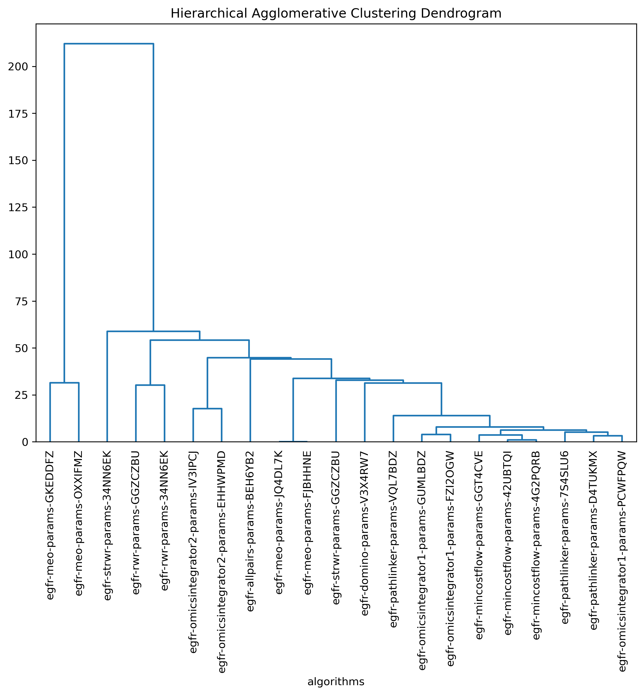

##########################################################
Intermediate Tutorial - Custom Data & Multi-Algorithm Runs
##########################################################

This tutorial builds on the introduction to SPRAS from the previous tutorial. 
It guides participants through how to convert data into a format usable by pathway reconstruction algorithms, run multiple algorithms within a single workflow, and apply new tools to interpret and compare the resulting pathways.

You will learn how to:

- Prepare and format data for use with SPRAS
- Configure and run additional pathway reconstruction algorithms on a dataset
- Enable post-analysis steps to generate post analysis information

Step 1: Transforming Data into SPRAS-Compatible Inputs 
======================================================

1.1 Understanding the Data
-------------------------------------------------------------------

We start with mass spectrometry data containing three biological replicates, each with two technical replicates (IMAC and IP).
ADD THAT WE COMBINE THESE TOGETHER
Each replicate measures peptide abundance across multiple time points (0 to 124 minutes).

Show images and charts as to what is changing instead of giving the code

The goal is to turn this experimental data into the format that SPRAS expects;
a list of proteins with associated prizes and a defined set of source and target proteins.

1.2 Filtering and Normalizing the Replicates
-------------------------------------------------------------------

When working with multiple replicates, we want to ensure that all of the peptides measures are present in all three replicates.
This guarantees consistent observation of the peptides across experiments.

For each replicate after removing the peptides that are not in all three replicates, each replicate needs to be renoramlized to ensure each replicate is internally consistent and comparable, reducing bias from replicate specific intensity differences.

1.3 Detecting Significant Changes using Tukey's HSD Test
--------------------------------------------------------------

After filtering and renormalizing, Tukey's Honest Significant Difference (HSD) test is preformed for each peptide.

Tukey's HSD evaluates the significance of differences in mean peptide intensities across all pairs of time points while correcting for multiple comparisons within each peptide's time course. 

For each peptide, Tukey's HSD reports a p-value for every pair of time points, representing how likely the observed difference in abundance occurred by chance across the three biological replicates. 
Lower p-values indicate stronger evidence that a peptide's abundance truly changes between those time points.

1.4 From p-values to Prizes for Pathway Reconstruction
--------------------------------------------------------

In SPRAS, prizes quantify how “interesting” a protein is to a given condition. 
Peptides with low p-values reflect statistically significant changes and therefore are likely to represent interesting biologically active or perturbed proteins to use for pathway reconstruction.

We transform the p-values into scores that capture statistically significant changes across replicates using the transformation -log10(p-value).
This produces higher scores for smaller p-values, highlighting peptides with stronger changes over time.

To compute these scores, we identify the smallest p-value across all relevant time comparisons for each peptide.
The relevant comparisons include each time point versus the baseline (0 min) and each consecutive time point.

We then apply the -log10 transformation to the smallest p-value for each peptide to obtain a positive prize score, where smaller p-values yield higher scores.
This process generates a peptide-level prize table that quantifies how strongly each peptide responds over time.

1.5 Aggregating Prizes at the Protein Level
--------------------------------------------

Multiple peptides can map to the same protein in this data, so we  keep the maximum prize among all its peptides, representing the strongest observed response.

We also convert the protein identifiers to UniProt Entry Names to ensure consistency across the other data sources that will be used, allowing all data components to align within the same naming space.

1.6 From Prizes to Source and Targets / Actives 
-----------------------------------------------

- add the egfr pathway (cite it) 

After assigning protein-level prizes, the next step is to define sources, targets, and actives for use in pathway reconstruction.

We use prior biological knowledge to guide this.
For example, in the EGFR signaling pathway, EGF acts as the initiating signal and EGFR as its receptor.
We can set EGF as the source (with the highest prize score) and EGFR as a target (with the second-highest score).
All other pathway proteins are treated as targets (with the score set from the previous step), since they represent downstream components influenced by EGF-EGFR signaling.

Finally, actives refer to nodes in a biological network that are significantly “on” or highly active under a given biological condition.
In this context, all proteins chosen can be considered active since they correspond to active under the given biological condition.

1.7 Combing the data into a spras standardized data 
---------------------------------------------------

1.8 Finding an Interactome to use
----------------------------------

Next, we need to define the interactome, the background protein-protein interaction (PPI) network used by pathway reconstruction algorithms to identify connections between sources and targets, prizes, and actives.

Databases, such as STRING, contatin interactomes that represent known interacts between proteins.

However, for this analysis, we use a human PPI network compiled from two sources:

- iRefIndex (version 13.0), containing 159,095 undirected interactions, and
- PhosphoSitePlus, containing 4,080 directed kinase–substrate interactions.

We merge the two sources, by prioritizing directed edges wherever possible otherwise keeping the undirected edges.
The final network contains 15,677 proteins, 157,984 undirected, and 3,917 directed interactions, using UniProt Entry Names for the identifiers of the nodes.

This interactome includes 653 of the 701 proteins with mass spectrometry-based prizes.

8) This data is already saved into SPRAS

.. code-block:: text

   spras/
   ├── .snakemake/
   │   └── log/
   │       └── ... snakemake log files ...
   ├── config/
   │   └── ...
   ├── inputs/
   │   ├── THE DATA
   │   └── THE NETWORK
   ├── outputs/
   │   └── basic/
   │       └── ... output files ...

Step 2: Adding multiple PRAs to the workflow
=============================================

Now that we've prepared our input data, we can begin running multiple pathway reconstruction algorithms on it.

For this part of the tutorial, we'll use a pre-defined configuration file that includes additional algorithms and post-analysis steps available in SPRAS.
Download it here: :download:`Intermediate Config File <../_static/config/intermediate.yaml>`

Save the file into the config/ folder of your SPRAS installation.

After adding this file, SPRAS will use the configuration to set up and reference your directory structure, which will look like this:

.. code-block:: text

   spras/
   ├── .snakemake/
   │   └── log/
   │       └── ... snakemake log files ...
   ├── config/
   │   └── basic.yaml
   │   └── intermediate.yaml
   ├── inputs/
   │   ├── THE DATA
   │   └── THE NETWORK
   ├── outputs/
   │   └── basic/
   │       └── ... output files ...

2.1 Supported Algorithms in SPRAS
---------------------------------

SPRAS supports a wide range of algorithms, each designed around different biological assumptions and optimization strategies:

- Pathlinker
- Omics Integrator 1 
- Omics Integrator 2
- MEO
- Minimum-Cost Flow
- All pairs shortest paths
- Domino
- Source-Targets Random Walk with Restarts
- Random Walk with Restarts
- BowTieBuilder (Not optimized for large datasets; slower on big networks)
- ResponseNet

Wrapped Algorithms
^^^^^^^^^^^^^^^^^^^
Each algorithm has been wrapped by SPRAS. 
Wrapping an algorithm in SPRAS involves three main steps:

1. Input generation: SPRAS creates and formats the input files required by the algorithm based on the provided dataset
2. Execution: SPRAS runs the algorithm within its corresponding Docker container, which holds the algorithm code. This is called for each specified parameter combination in the configuration file.
3. Output Standardization: The raw outputs are converted into a standardized SPRAS format

Inputs
^^^^^^^
These pathway reconstruction algorithms differ in the inputs nodes they require and how they interpret those nodes to identify subnetworks.
Some use source and target nodes to connect predefined start and end points, others use prizes, which are scores assigned to nodes of interest, and some rely on active nodes that represent proteins or genes significantly “on” or perturbed under specific biological conditions.

Along with differences in their inputs nodes, these algorithms also interpret the input interactome differently. 
Some can handle directed graphs, others work only with undirected graphs, and a few support mixed directionaltiy graphs.

Parameters
^^^^^^^^^^
Each algorithm also exposes its own set of parameters that control its optimization strategy.
Some algorithms have no adjustable parameters, while others include multiple tunable settings that influence how subnetworks are created.
These parameters vary widely between algorithms and reflect the unique optimization techniques each method employs under the hood.

2.3 Running SPRAS with Multiple Algorithms
------------------------------------------
In the intermediate.yaml configuration file, it is set up have SPRAS run multiple algorithms (all of the algorithms supported in SPRAS except BowTieBuilder) with multiple parameter settings (if available) on one dataset.

From the root directory spras/, run the command below from the command line:

.. code:: bash

    snakemake --cores 4 --configfile config/intermediate.yaml

What Happens When You Run This Command
^^^^^^^^^^^^^^^^^^^^^^^^^^^^^^^^^^^^^^^

SPRAS will run more slowly than the beginner.yaml configuration. 
The same automated steps as in beginner.yaml (managed by Snakemake and Docker) run behind the scenes for intermediate.yaml; however, this configuration now runs multiple algorithms with different parameter combinations, which takes longer to complete.
By increasing the number of cores to 4, it allows Snakemake to parallelize the work locally, speeding up execution when possible.

1. Snakemake starts the workflow

Snakemake reads the options set in the intermediate.yaml configuration file and determines which datasets, algorithms, and parameter combinations need to run.  It also checks if any post-analysis steps were requested.

2. Preparing the dataset

SPRAS takes the interactome and node prize files specified in the configuration and bundles them into a Dataset object to be used for processing algorithm specific inputs. 
This object is stored as a .pickle file so it can be reused for other algorithms without re-processing it.

3. Creating algorithm specific inputs

For each algorithm marked as include: true in the configuration, SPRAS generates input files tailored to that algorithm. 
In this case, every algorithm is enabled, so SPRAS creates the files required for each algorithm.

4. Organizing results with parameter hashes

Each <dataset>-<algorithm>-params-<a hash> combination folder is created. 
A matching log file in logs/parameters-<algorithm>-params-<a hash>.yaml records the exact parameter values used.

5. Running the algorithm

SPRAS executes each algorithm by launching its corresponding Docker image multiple times (once for each parameter configuration). 
During each run, SPRAS provides the prepared input files and the corresponding parameter settings to the container. Each algorithm then runs independently within its Docker environment and produces a raw pathway output file (raw-pathway.txt), which contains the reconstructed subnetwork in the algorithm's native format.

6. Standardizing the results

SPRAS parses each of the raw output into a standardized SPRAS format (pathway.txt). 
This ensures all algorithms output are put into a standardized output, because their native formats differ.

7. Logging the Snakemake run 

Snakemake creates a dated log in .snakemake/log/. This log shows what rules ran and any errors that occurred during the SPRAS run.

What Your Directory Structure Should Like After This Run:
^^^^^^^^^^^^^^^^^^^^^^^^^^^^^^^^^^^^^^^^^^^^^^^^^^^^^^^^^

.. code-block:: text

   spras/
   ├── .snakemake/
   │   └── log/
   │       └── ... snakemake log files ...
   ├── config/
   │   └── basic.yaml
   ├── inputs/
   │   ├── phosphosite-irefindex13.0-uniprot.txt
   │   └── tps-egfr-prizes.txt
   ├── outputs/
   │   └── basic/
   │       └── dataset-egfr-merged.pickle
   │       └── egfr-meo-params-FJBHHNE
   │            └── pathway.txt
   │            └── raw-pathway.txt
   │       └── egfr-meo-params-GKEDDFZ
   │            └── pathway.txt
   │            └── raw-pathway.txt
   │       └── egfr-meo-params-JQ4DL7K
   │            └── pathway.txt
   │            └── raw-pathway.txt
   │       └── egfr-meo-params-OXXIFMZ
   │            └── pathway.txt
   │            └── raw-pathway.txt
   │       └── egfr-mincostflow-params-42UBTQI
   │            └── pathway.txt
   │            └── raw-pathway.txt
   │       └── egfr-mincostflow-params-4G2PQRB
   │            └── pathway.txt
   │            └── raw-pathway.txt
   │       └── egfr-omicsintegrator1-params-FZI2OGW
   │            └── pathway.txt
   │            └── raw-pathway.txt
   │       └── egfr-omicsintegrator1-params-GUMLBDZ
   │            └── pathway.txt
   │            └── raw-pathway.txt
   │       └── egfr-omicsintegrator1-params-PCWFPQW
   │            └── pathway.txt
   │            └── raw-pathway.txt
   │       └── egfr-omicsintegrator2-params-EHHWPMD
   │            └── pathway.txt
   │            └── raw-pathway.txt
   │       └── egfr-omicsintegrator2-params-IV3IPCJ
   │            └── pathway.txt
   │            └── raw-pathway.txt
   │       └── egfr-pathlinker-params-4YXABT7
   │            └── pathway.txt
   │            └── raw-pathway.txt
   │       └── egfr-pathlinker-params-7S4SLU6
   │            └── pathway.txt
   │            └── raw-pathway.txt
   │       └── egfr-pathlinker-params-D4TUKMX
   │            └── pathway.txt
   │            └── raw-pathway.txt
   │       └── egfr-pathlinker-params-VQL7BDZ
   │            └── pathway.txt
   │            └── raw-pathway.txt
   │       └── egfr-rwr-params-34NN6EK
   │            └── pathway.txt
   │            └── raw-pathway.txt
   │       └── egfr-rwr-params-GGZCZBU
   │            └── pathway.txt
   │            └── raw-pathway.txt
   │       └── egfr-strwr-params-34NN6EK
   │            └── pathway.txt
   │            └── raw-pathway.txt
   │       └── egfr-strwr-params-GGZCZBU
   │            └── pathway.txt
   │            └── raw-pathway.txt
   │       └── logs
   │            └── datasets-egfr.yaml
   │            └── parameters-allpairs-params-BEH6YB2.yaml
   │            └── parameters-domino-params-V3X4RW7.yaml
   │            └── parameters-meo-params-FJBHHNE.yaml
   │            └── parameters-meo-params-GKEDDFZ.yaml
   │            └── parameters-meo-params-JQ4DL7K.yaml
   │            └── parameters-meo-params-OXXIFMZ.yaml
   │            └── parameters-mincostflow-params-42UBTQI.yaml
   │            └── parameters-mincostflow-params-4G2PQRB.yaml
   │            └── parameters-mincostflow-params-GGT4CVE.yaml
   │            └── parameters-omicsintegrator1-params-FZI2OGW.yaml
   │            └── parameters-omicsintegrator1-params-GUMLBDZ.yaml
   │            └── parameters-omicsintegrator1-params-PCWFPQW.yaml
   │            └── parameters-omicsintegrator2-params-EHHWPMD.yaml
   │            └── parameters-omicsintegrator2-params-IV3IPCJ.yaml
   │            └── parameters-pathlinker-params-4YXABT7.yaml
   │            └── parameters-pathlinker-params-7S4SLU6.yaml
   │            └── parameters-pathlinker-params-D4TUKMX.yaml
   │            └── parameters-pathlinker-params-VQL7BDZ.yaml
   │            └── parameters-rwr-params-34NN6EK.yaml
   │            └── parameters-rwr-params-GGZCZBU.yaml
   │            └── parameters-strwr-params-34NN6EK.yaml
   │            └── parameters-strwr-params-GGZCZBU.yaml
   │       └── prepared
   │            └── egfr-domino-inputs
   │                ├── active_genes.txt
   │                └── network.txt
   │            └── egfr-meo-inputs
   │                ├── edges.txt
   │                ├── sources.txt
   │                └── targets.txt
   │            └── egfr-mincostflow-inputs
   │                ├── edges.txt
   │                ├── sources.txt
   │                └── targets.txt
   │            └── egfr-omicsintegrator1-inputs
   │                ├── dummy_nodes.txt
   │                ├── edges.txt
   │                └── prizes.txt
   │            └── egfr-omicsintegrator2-inputs
   │                ├── edges.txt
   │                └── prizes.txt
   │            └── egfr-pathlinker-inputs
   │                ├── network.txt
   │                ── nodetypes.txt
   │            └── egfr-rwr-inputs
   │                ├── network.txt
   │                └── nodes.txt
   │            └── egfr-strwr-inputs
   |                ├── network.txt
   |                ├── sources.txt
   |                └── targets.txt

2.4 Reviewing the pathway.txt Files 
-------------------------------------------
After running the intermediate configuration file, the output/intermediate/ directory will contain many more subfolders and files.

Just like in the beginner tutorial, each algorithm's results can be found in the spras/output/intermediate/ directory.
Within it, you'll see subfolders corresponding to each dataset-algorithm-parameter combination. 
Each folder contains a pathway.txt file that contains the standardized reconstructed subnetwork for that specific run.

For example, the file egfr-mincostflow-params-42UBTQI/pathway.txt contains the following reconstructed subnetwork:

.. code-block:: text
        
    Node1	Node2	Rank	Direction
    CBL_HUMAN	EGFR_HUMAN	1	U
    EGFR_HUMAN	EGF_HUMAN	1	U
    EMD_HUMAN	LMNA_HUMAN	1	U
    FYN_HUMAN	KS6A3_HUMAN	1	U
    EGF_HUMAN	HDAC6_HUMAN	1	U
    HDAC6_HUMAN	HS90A_HUMAN	1	U
    KS6A3_HUMAN	SRC_HUMAN	1	U
    EGF_HUMAN	LMNA_HUMAN	1	U
    MYH9_HUMAN	S10A4_HUMAN	1	U
    EGF_HUMAN	S10A4_HUMAN	1	U
    EMD_HUMAN	SRC_HUMAN	1	U

And the file egfr-omicsintegrator1-params-GUMLBDZ/pathway.txt contains the following reconstructed subnetwork:

.. code-block:: text
        
    Node1	Node2	Rank	Direction
    CBLB_HUMAN	EGFR_HUMAN	1	U
    CBL_HUMAN	CD2AP_HUMAN	1	U
    CBL_HUMAN	CRKL_HUMAN	1	U
    CBL_HUMAN	EGFR_HUMAN	1	U
    CBL_HUMAN	PLCG1_HUMAN	1	U
    CDK1_HUMAN	NPM_HUMAN	1	D
    CHD4_HUMAN	HDAC2_HUMAN	1	U
    EGFR_HUMAN	EGF_HUMAN	1	U
    EGFR_HUMAN	GRB2_HUMAN	1	U
    EIF3B_HUMAN	EIF3G_HUMAN	1	U
    FAK1_HUMAN	PAXI_HUMAN	1	U
    GAB1_HUMAN	PTN11_HUMAN	1	U
    GRB2_HUMAN	PTN11_HUMAN	1	U
    GRB2_HUMAN	SHC1_HUMAN	1	U
    HDAC2_HUMAN	SIN3A_HUMAN	1	U
    HGS_HUMAN	STAM2_HUMAN	1	U
    KS6A1_HUMAN	MK01_HUMAN	1	U
    MK01_HUMAN	ABI1_HUMAN	1	D
    MK01_HUMAN	ERF_HUMAN	1	D
    MRE11_HUMAN	RAD50_HUMAN	1	U

As you explore more of these files, you'll notice that the subnetworks vary widely across algorithms and parameter settings.
While you can still open and inspect these files manually, the number of outputs is much greater than in the beginner.yaml run, making manual inspection less practical.
The pathway.txt outputs serve as the foundation for further post-analysis, where you can systematically compare and interpret the reconstructed networks in greater detail.

In the next steps, we'll use SPRAS's internal post analyses tools to further explore and analyze these outputs.

Step 3: Use ML Post-Analysis
=============================

To enable downstream analyses, update the analysis section in your configuration file by setting both summary, cytoscape, and ml, to true. Your analysis section in the configuration file should look like this:

.. code-block:: text

    analysis:
        ml:
            include: true

In this part of the tutorial, we're also including the machine learning (ml) section to enable machine learning-based post-analysis built within SPRAS.

The ml analysis will perform unsupervised analyses such as Principal Component Analysis (PCA), Hierarchical Agglomerative Clustering (HAC), ensembling, and Jaccard similarity comparisons of the pathways.
- These analyses help uncover patterns and similarities between different algorithms run on a given dataset
- if aggregate_per_algorithm: is set to true, it additionally groups outputs by algorithm within each dataset to uncover patterns and similarities for an algorithm
- The ML section includes configurable parameters that let you adjust the behavior of the ml analyses performed

With these updates, SPRAS will run the full set of unsupervised machine learning analyses across all outputs for a given dataset.

After saving the changes in the configuration file, rerun with:

.. code:: bash

    snakemake --cores 4 --configfile config/intermediate.yaml

What Happens When You Run This Command
^^^^^^^^^^^^^^^^^^^^^^^^^^^^^^^^^^^^^^^
1. Reusing cached results

Snakemake reads the options set in intermediate.yaml and checks for any requested post-analysis steps. 
It reuses cached results; in this case, the pathway.txt files generated from the previously executed algorithms + parameter combinations on the egfr dataset.

2.	Running the ml analysis

SPRAS aggregates all files generated for a dataset.
These groupings include all the reconstructed subnetworks produced across algorithm for a given dataset (and, if enabled, grouped outputs per algorithm for a given dataset).
SPRAS then performs all machine learning analyses on each grouping and saves the results in the dataset-ml/ directory.

What Your Directory Structure Should Like After This Run:
^^^^^^^^^^^^^^^^^^^^^^^^^^^^^^^^^^^^^^^^^^^^^^^^^^^^^^^^^

.. code-block:: text

   spras/
   ├── .snakemake/
   │   └── log/
   │       └── ... snakemake log files ...
   ├── config/
   │   └── basic.yaml
   ├── inputs/
   │   ├── phosphosite-irefindex13.0-uniprot.txt
   │   └── tps-egfr-prizes.txt
   ├── outputs/
   │   └── basic/
   │       └── dataset-egfr-merged.pickle
   │       └── egfr-meo-params-FJBHHNE
   │            └── pathway.txt
   │            └── raw-pathway.txt
   │       └── egfr-meo-params-GKEDDFZ
   │            └── pathway.txt
   │            └── raw-pathway.txt
   │       └── egfr-meo-params-JQ4DL7K
   │            └── pathway.txt
   │            └── raw-pathway.txt
   │       └── egfr-meo-params-OXXIFMZ
   │            └── pathway.txt
   │            └── raw-pathway.txt
   │       └── egfr-mincostflow-params-42UBTQI
   │            └── pathway.txt
   │            └── raw-pathway.txt
   │       └── egfr-mincostflow-params-4G2PQRB
   │            └── pathway.txt
   │            └── raw-pathway.txt
   │       └── egfr-omicsintegrator1-params-FZI2OGW
   │            └── pathway.txt
   │            └── raw-pathway.txt
   │       └── egfr-omicsintegrator1-params-GUMLBDZ
   │            └── pathway.txt
   │            └── raw-pathway.txt
   │       └── egfr-omicsintegrator1-params-PCWFPQW
   │            └── pathway.txt
   │            └── raw-pathway.txt
   │       └── egfr-omicsintegrator2-params-EHHWPMD
   │            └── pathway.txt
   │            └── raw-pathway.txt
   │       └── egfr-omicsintegrator2-params-IV3IPCJ
   │            └── pathway.txt
   │            └── raw-pathway.txt
   │       └── egfr-pathlinker-params-4YXABT7
   │            └── pathway.txt
   │            └── raw-pathway.txt
   │       └── egfr-pathlinker-params-7S4SLU6
   │            └── pathway.txt
   │            └── raw-pathway.txt
   │       └── egfr-pathlinker-params-D4TUKMX
   │            └── pathway.txt
   │            └── raw-pathway.txt
   │       └── egfr-pathlinker-params-VQL7BDZ
   │            └── pathway.txt
   │            └── raw-pathway.txt
   │       └── egfr-rwr-params-34NN6EK
   │            └── pathway.txt
   │            └── raw-pathway.txt
   │       └── egfr-rwr-params-GGZCZBU
   │            └── pathway.txt
   │            └── raw-pathway.txt
   │       └── egfr-strwr-params-34NN6EK
   │            └── pathway.txt
   │            └── raw-pathway.txt
   │       └── egfr-strwr-params-GGZCZBU
   │            └── pathway.txt
   │            └── raw-pathway.txt
   │       └── egfr-ml
   │            └── ensemble-pathway.txt
   │            └── hac-clusters-horizontal.txt
   │            └── hac-clusters-vertical.txt
   │            └── hac-horizontal.png
   │            └── hac-vertical.png
   │            └── jaccard-heatmap.png
   │            └── jaccard-matrix.txt
   │            └── pca-coordinates.txt
   │            └── pca-variance.txt
   │            └── pca.png
   │       └── logs
   │            └── datasets-egfr.yaml
   │            └── parameters-allpairs-params-BEH6YB2.yaml
   │            └── parameters-domino-params-V3X4RW7.yaml
   │            └── parameters-meo-params-FJBHHNE.yaml
   │            └── parameters-meo-params-GKEDDFZ.yaml
   │            └── parameters-meo-params-JQ4DL7K.yaml
   │            └── parameters-meo-params-OXXIFMZ.yaml
   │            └── parameters-mincostflow-params-42UBTQI.yaml
   │            └── parameters-mincostflow-params-4G2PQRB.yaml
   │            └── parameters-mincostflow-params-GGT4CVE.yaml
   │            └── parameters-omicsintegrator1-params-FZI2OGW.yaml
   │            └── parameters-omicsintegrator1-params-GUMLBDZ.yaml
   │            └── parameters-omicsintegrator1-params-PCWFPQW.yaml
   │            └── parameters-omicsintegrator2-params-EHHWPMD.yaml
   │            └── parameters-omicsintegrator2-params-IV3IPCJ.yaml
   │            └── parameters-pathlinker-params-4YXABT7.yaml
   │            └── parameters-pathlinker-params-7S4SLU6.yaml
   │            └── parameters-pathlinker-params-D4TUKMX.yaml
   │            └── parameters-pathlinker-params-VQL7BDZ.yaml
   │            └── parameters-rwr-params-34NN6EK.yaml
   │            └── parameters-rwr-params-GGZCZBU.yaml
   │            └── parameters-strwr-params-34NN6EK.yaml
   │            └── parameters-strwr-params-GGZCZBU.yaml
   │       └── prepared
   │            └── egfr-domino-inputs
   │                ├── active_genes.txt
   │                └── network.txt
   │            └── egfr-meo-inputs
   │                ├── edges.txt
   │                ├── sources.txt
   │                └── targets.txt
   │            └── egfr-mincostflow-inputs
   │                ├── edges.txt
   │                ├── sources.txt
   │                └── targets.txt
   │            └── egfr-omicsintegrator1-inputs
   │                ├── dummy_nodes.txt
   │                ├── edges.txt
   │                └── prizes.txt
   │            └── egfr-omicsintegrator2-inputs
   │                ├── edges.txt
   │                └── prizes.txt
   │            └── egfr-pathlinker-inputs
   │                ├── network.txt
   │                ── nodetypes.txt
   │            └── egfr-rwr-inputs
   │                ├── network.txt
   │                └── nodes.txt
   │            └── egfr-strwr-inputs
   |                ├── network.txt
   |                ├── sources.txt
   |                └── targets.txt

Step 3.1: Reviewing the Outputs
--------------------------------

Ensembles
^^^^^^^^^
After running multiple algorithms or parameter settings on the same dataset, SPRAS can ensemble the resulting pathways to identify consistent, high-confidence interactions.

Each pathway output is represented as a binary edge list (1 = edge present, 0 = edge absent).
SPRAS calculates the mean of these binary values across all runs to determine the edge frequency (the proportion of times each edge appears across the outputs).
Edges that occur more often are considered more robust and can be used to build a consensus network.

.. code-block:: text

    Node1	Node2	Frequency	Direction
    EGF_HUMAN	EGFR_HUMAN	0.42857142857142855	D
    EGF_HUMAN	S10A4_HUMAN	0.38095238095238093	D
    S10A4_HUMAN	MYH9_HUMAN	0.38095238095238093	D
    K7PPA8_HUMAN	MDM2_HUMAN	0.09523809523809523	D
    MDM2_HUMAN	P53_HUMAN	0.19047619047619047	D
    S10A4_HUMAN	K7PPA8_HUMAN	0.19047619047619047	D
    K7PPA8_HUMAN	SIR1_HUMAN	0.19047619047619047	D
    MDM2_HUMAN	MDM4_HUMAN	0.09523809523809523	D
    MDM4_HUMAN	P53_HUMAN	0.09523809523809523	D
    CD2A2_HUMAN	CDK4_HUMAN	0.09523809523809523	D
    CDK4_HUMAN	RB_HUMAN	0.09523809523809523	D
    MDM2_HUMAN	CD2A2_HUMAN	0.09523809523809523	D
    EP300_HUMAN	P53_HUMAN	0.2857142857142857	D
    K7PPA8_HUMAN	EP300_HUMAN	0.09523809523809523	D
    ...
    
High frequency edges indicate interactions consistently recovered by multiple algorithms, suggesting stronger biological relevance.
Low frequency edges may reflect noise or algorithm-specific connections.

HAC
^^^
SPRAS includes Hierarchical Agglomerative Clustering (HAC) to group similar pathways outputs based on shared edges.
This helps identify clusters of algorithms that produce comparable subnetworks and highlights distinct reconstruction behaviors.

In the plots below, each branch represents a cluster of related pathways.
Shorter distances between branches indicate greater similarity.

.. raw:: html

   

.. image:: ../_static/images/hac-vertical.png
   :alt: description of the image
   :width: 300
   :align: center

.. raw:: html

   

HAC visualizations help compare which algorithms and parameter settings produce similar pathway structures.
Tight clusters indicate similar behavior, while isolated branches may reveal unique or outlier results.

PCA
^^^
SPRAS also includes Principal Component Analysis (PCA) to visualize variation across pathway outputs.
Each point represents a pathway, places based on its overall network structure.
Pathways that cluster together in PCA space are more similar, while those farther apart differ in their reconstructed subnetworks.

.. image:: ../_static/images/pca.png
   :alt: description of the image
   :width: 500
   :align: center

.. raw:: html

   

PCA can help identify patterns such as clusters of similar algorithms, parameter sensitivities, or outlier outputs.

Jaccard Similarity
^^^^^^^^^^^^^^^^^^

SPRAS computes pairwise Jaccard similarity between pathway outputs to measure how much overlap exists between their reconstructed subnetworks.
The Jaccard index is calculated from the binary edge representation of each pathway and reflects the proportion of shared edges between two pathways relative to their total combined edges.

Higher similarity values indicate that pathways share many of the same interactions, while lower values suggest distinct or divergent reconstructions.

.. image:: ../_static/images/jaccard-heatmap.png
   :alt: description of the image
   :width: 500
   :align: center

.. raw:: html

   

The heatmap visualizes how similar the output pathways are between algorithms and parameter settings. 