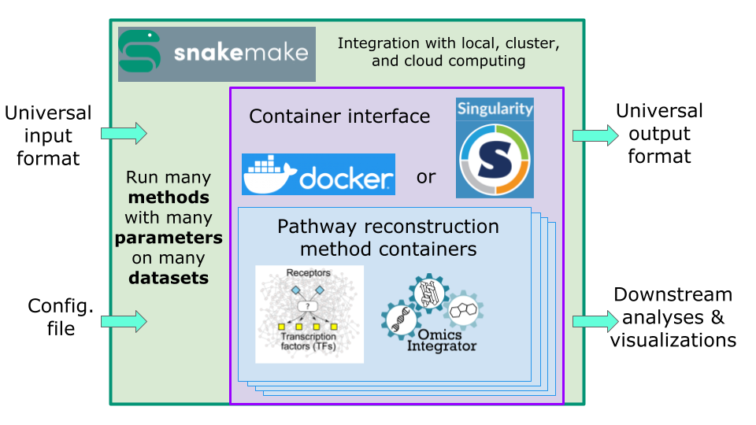

################
 SPRAS Tutorial
################

**************************
 Purpose of this tutorial
**************************

This tutorial will introduce participants to SPRAS and demonstrate how
it can be used to explore biological pathways from omics data.

Together, we will cover:

#. How to set up and run SPRAS
#. Running multiple algorithms with different parameters across one
   datasets
#. Using the post-analysis tools to evaluate and compare results
#. Building datasets for analysis
#. Other things you can do with SPRAS

*********************************
 Prerequisites for this tutorial
*********************************

Required software:

-  `Conda
   <https://docs.conda.io/projects/conda/en/latest/user-guide/install/index.html>`__
   : for managing environments

-  `Docker <https://www.docker.com/get-started/>`__ : for containerized
   runs

-  `Git <https://git-scm.com/downloads>`__: for cloning the SPRAS
   repository

-  A terminal or code editor (`VS Code
   <https://code.visualstudio.com/download>`__ is recommended, but any
   terminal will work)

-  (Optional) `Cytoscape <https://cytoscape.org/>`__ for visualizing
   networks (download locally, the web version will not suffice)

.. note::

   Mac users who experience performance issues with Docker Desktop can
   try `OrbStack <https://orbstack.dev/>`_ as an alternative.

Required knowledge:

-  Ability to run command line operations and modify YAML files.
-  Basic biology concepts

.. note::

   This tutorial will require downloading approximately 18.3 GB of
   Docker images and running many Docker containers.

   SPRAS does not automatically clean up these containers or images
   after execution, so users will need to remove them manually if
   desired.

   To stop all running containers: ``docker stop $(docker ps -a -q)``

   To remove all stopped containers: ``docker container prune``

   To remove unused Docker images: ``docker image prune``

Opening SPRAS in a GitHub Codespace
===================================

SPRAS also ships with a dev container, and the quickest way to use it is
through `GitHub Codespaces <https://github.com/features/codespaces>`_.

A Codespace builds the dev container on GitHub's infrastructure and
opens it in your browser, so you do not need to install Docker or set up
a local Python environment. The ``.devcontainer`` configuration in SPRAS
sets up the environment for you.

Prerequisites
-------------

A GitHub account. Sign up at `github.com <https://github.com>`_ if you
do not have one.

Create a Codespace
------------------

#. Go to `github.com/codespaces <https://github.com/codespaces>`_.
#. Select **New codespace**.
#. In the repository field, search for and select
   ``Reed-CompBio/spras``.
#. Select **Create codespace**.

GitHub builds the container from the SPRAS ``.devcontainer``
configuration (the first build takes a few minutes) and opens a VS Code
environment in your browser with the SPRAS dependencies already
installed. Once the build finishes, you are ready to run SPRAS.

.. note::

   This tutorial's Codespace is configured with 4 CPUs. Some SPRAS
   commands in this tutorial are set to ``--cores 8``; lower this to
   ``--cores 4`` to match the available CPUs. However, if you leave it
   at 8, SPRAS will still run and uses only the 4 CPUs it has.

################
 SPRAS Overview
################

*********************************
 What is pathway reconstruction?
*********************************

A pathway is a type of graph that describes how different molecules
interact with one another for a biological process.

Curated pathway databases provide useful well studied references of
pathways but are often general or incomplete. This means they may miss
context-specific details relevant to a particular condition or
experiment.

Pathway reconstruction algorithms address this by mapping molecules of
interest onto large-scale interaction networks (interactomes) to
generate candidate context-specific subnetworks that better reflect the
condition or experiment.

These algorithms allow researchers to propose computational-backed
hypothetical subnetworks that capture the unique characteristics of a
given context without having to experimentally test every individual
interaction.

Running a single pathway reconstruction algorithm on a single dataset
can be challenging, as each algorithm often requires its own input
format, software environment, or even a full reimplementation. These
challenges only grow when scaling up to using multiple algorithms and
datasets.

****************
 What is SPRAS?
****************

.. raw:: html

   

Signaling Pathway Reconstruction Analysis Streamliner (SPRAS) is a
computational framework that unifies and simplifies the use of diverse
pathway reconstruction algorithms.

SPRAS allows users to run multiple datasets across multiple algorithms
and many parameter settings in a single scalable workflow. The framework
automatically handles data preprocessing, algorithm execution, and
post-processing, allowing users to run multiple algorithms seamlessly
without manual setup. Built-in analysis tools enable users to explore,
compare, and evaluate reconstructed pathways with ease.

SPRAS is implemented in Python and leverages two technologies for
workflow automation:

-  Snakemake: a workflow management system that defines and executes
   jobs automatically, removing the need for users to write complex
   scripts

-  Docker: runs algorithms and post analysis in a containerized
   environment.

A key strength of SPRAS is automation. From provided input data and
configurations, SPRAS can generate and execute complete workflows
without requiring users to write complex scripts. This lowers the
barrier to entry, allowing researchers to apply, evaluate, and compare
multiple pathway reconstruction algorithms without deep computational
expertise.
